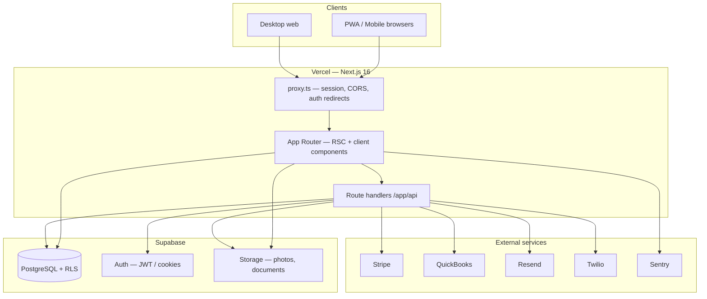

# HazardOS — Application Architecture (Overview)

**Purpose:** One-place summary of how the app is structured. For deep dives (security, deployment, full schema notes), see [architecture.md](./architecture.md) and project root [CLAUDE.md](../CLAUDE.md).

**Last updated:** April 29, 2026

---

## What This Application Is

HazardOS is a **multi-tenant SaaS** for environmental remediation companies (asbestos, lead, mold, etc.). It covers the operational lifecycle: **CRM** (contacts, companies, opportunities, pipeline, jobs), **site surveys** (mobile-first field workflows), **estimates and proposals**, **job execution** (scheduling, completion, variance), **invoicing** and integrations (Stripe, QuickBooks, messaging), plus **analytics and reporting**.

---

## High-Level System Shape

- **Browser** talks to **Vercel-hosted Next.js** over HTTPS.
- **Data of record** lives in **Supabase PostgreSQL** with **Row-Level Security (RLS)** per organization.
- **Files** (survey photos, PDFs) use **Supabase Storage** with bucket policies aligned to RLS.
- **Business integrations** are invoked from **API routes** and background/cron-style handlers.

---

## Technology Stack (Condensed)

| Concern | Choice |
|--------|--------|
| Framework | Next.js 16 (App Router) |
| UI | React 19, Tailwind CSS 4, Radix + shadcn-style `components/ui` |
| Types | TypeScript (strict) |
| Server state | TanStack Query |
| Client state | Zustand (survey wizard, photo queue, etc.) |
| Forms | react-hook-form + Zod |
| Database & auth | Supabase (Postgres, Auth, Storage) |
| Edge behavior | `proxy.ts` (not legacy `middleware.ts`) |
| Observability | Sentry, Vercel Analytics |
| PWA | Serwist (`@serwist/next`) |

---

## Edge and Auth Flow

**`proxy.ts`** (project root) is the Next.js 16 edge entry point. It:

1. Runs **CORS** handling (`lib/middleware/cors.ts`).
2. Refreshes the **Supabase session** (`lib/supabase/middleware.ts` → `updateSession`).
3. Redirects **unauthenticated** users away from dashboard routes to `/login`, and **authenticated** users away from auth pages (with an exception for invite signup).

Auth cookies are **chunked** (`sb-*-auth-token.*`); detection uses `includes('-auth-token')`, not a simple suffix match.

**Split clients:**

- **Server** components and route handlers: `lib/supabase/server.ts` (cookie-based session).
- **Browser** components: `lib/supabase/client.ts`.

---

## Next.js App Router Layout

### Route groups

| Group | Role |
|-------|------|
| `app/(auth)/` | Login, signup, password reset — minimal chrome. |
| `app/(dashboard)/` | Main product: sidebar/top nav, `AuthProvider`, feature pages. |
| `app/(dashboard)/crm/` | CRM hub with its own sub-nav (contacts, companies, opportunities, pipeline, jobs). |
| `app/(dashboard)/site-surveys/` | Site surveys; includes **mobile** layouts under `site-surveys/mobile/`. |
| `app/(platform)/` | Platform administration (cross-tenant). |
| `app/api/` | REST-style route handlers (internal app API, webhooks, cron, public `/api/v1/*`). |

Root `app/layout.tsx` wraps the tree with **QueryProvider**, **AnalyticsProvider**, **Toaster**, and global styles.

The **dashboard** `layout.tsx` defines primary navigation (Dashboard, CRM, Surveys, Estimates, Jobs, Manifests, Invoices, Calendar, Messaging, Settings) and gates content on multi-tenant auth.

---

## Backend and Data Access Patterns

### Multi-tenancy

- Almost every business table includes **`organization_id`**.
- **RLS** policies scope reads/writes to the current user’s org via helpers such as `get_user_organization_id()`.
- **Platform users** (`is_platform_user`) can cross org boundaries where policies allow.

### Where logic lives

- **`lib/supabase/*.ts`** — thin data access and Supabase-oriented services (e.g. customers, companies, site surveys).
- **`lib/services/*.ts`** — domain workflows (pipeline, photo upload queue, activity logging, integrations, reporting, etc.).
- **`lib/hooks/*.ts`** — TanStack Query wrappers for entities and cross-cutting concerns (`use-multi-tenant-auth`, etc.).
- **`lib/stores/*.ts`** — Zustand stores for long-running client flows (e.g. offline-friendly survey state, photo queue).
- **`types/`** — Shared TS types; `types/database.ts` mirrors the DB contract.

### API routes

- **Internal APIs** typically use **`createApiHandler`** (`lib/utils/api-handler.ts`): session auth, optional role checks (`allowedRoles`), Zod validation, rate limits, structured logging, sanitized errors (`SecureError`).
- **`/api/v1/*`** — **API key** authentication (`lib/middleware/api-key-auth.ts`) for external consumers; scoped permissions.
- **`/api/webhooks/*`** — Provider callbacks (e.g. Stripe, Resend); excluded from the dashboard auth redirect in `proxy.ts`; verified inside each handler.

---

## Major Product Modules (How They Map to Code)

| Module | Typical UI | Backend / lib |
|--------|------------|----------------|
| CRM | `app/(dashboard)/crm/*`, `components/customers`, `components/companies`, `components/pipeline` | `lib/services/pipeline-service.ts`, `lib/supabase/customers.ts`, hooks under `lib/hooks` |
| Site surveys | `app/(dashboard)/site-surveys/*`, `components/surveys/mobile/*` | `lib/supabase/site-survey-service.ts`, `lib/stores/survey-store.ts`, `lib/services/photo-upload-service.ts` |
| Estimates / proposals | `app/(dashboard)/estimates/*`, `components/proposals` | API under `app/api/estimates`, `app/api/proposals`, validations in `lib/validations` |
| Jobs | `app/(dashboard)/jobs/*`, CRM jobs | `app/api/jobs/*`, completion and variance services |
| Billing / settings | `app/(dashboard)/settings/*` | Stripe, org endpoints, `lib/validations/settings.ts` |

---

## Integrations (Conceptual)

- **Stripe** — Subscriptions and billing portals.
- **QuickBooks** — Customer/invoice sync; OAuth callbacks under `app/api/integrations/quickbooks/`.
- **Resend** — Transactional email; webhooks for delivery events.
- **Twilio** — SMS; inbound webhooks and TCPA-related flows.
- **Calendar** — Google/Outlook connect flows under `app/api/integrations/*-calendar/`.
- **CRM/marketing** — HubSpot, Mailchimp sync endpoints where configured.

---

## Testing and Quality Gates

- **Vitest** for unit/integration tests (`test/`), including **RLS-oriented** checks where applicable.
- Scripts: `npm run type-check`, `lint`, `test:run`, `build` — align with team pre-commit expectations.

---

## Related Documents

| Document | Contents |
|----------|----------|
| [architecture.md](./architecture.md) | Full architecture guide: detailed diagrams, API surface, DB notes, deployment |
| [DATABASE-STRUCTURE.md](./DATABASE-STRUCTURE.md) | Database tables by domain, multi-tenancy, ER overview |
| [NOTIFICATIONS.md](./NOTIFICATIONS.md) | In-app and email notification system, preferences, APIs |
| [MULTI_TENANT_SETUP.md](./MULTI_TENANT_SETUP.md) | Tenant configuration |
| [API-REFERENCE.md](./API-REFERENCE.md) | HTTP endpoints |
| [CLAUDE.md](../CLAUDE.md) | Day-to-day conventions, CRM model, gotchas |

---

*This overview is maintained to reflect the current codebase layout; when in doubt, trust the repository tree and `CLAUDE.md`.*
