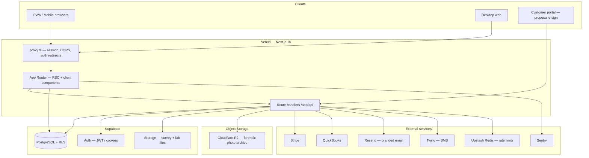

# HazardOS — Application Architecture (Overview)

**Purpose:** One-place summary of how the app is structured. For deep dives (security, deployment, full schema notes), see [architecture.md](./architecture.md), [DATABASE-STRUCTURE.md](./DATABASE-STRUCTURE.md), and project root [CLAUDE.md](../CLAUDE.md).

**Last updated:** 2026-05-05

---

## What This Application Is

HazardOS is a **multi-tenant SaaS** for environmental remediation companies (asbestos, lead, mold, vermiculite, transite siding, etc.). It covers the full operational lifecycle:

- **CRM** — contacts, companies, opportunities, pipeline, jobs, multi-touch attribution
- **Site surveys** — desktop + mobile-first field workflows with offline-tolerant photo capture
- **Estimates and proposals** — hazard-specific templates, variant pricing, customer e-sign portal
- **Job execution** — scheduling, regulatory notification, daily logs, change orders, completion + variance
- **Lab reports** — sample tracking, file attachment, status flow (ordered → received → cancelled)
- **Invoicing and payments** — line items, invoice-level discount, partial/Net-N terms, Stripe + QuickBooks
- **Messaging** — SMS conversations (Twilio), branded transactional email (Resend)
- **Analytics, reporting, and forensic audit trail** for hazardous-materials compliance

The primary user persona is a 5–50-employee abatement company doing residential and commercial work.

---

## High-Level System Shape



- **Browser** talks to **Vercel-hosted Next.js** over HTTPS.
- **Data of record** lives in **Supabase PostgreSQL** with **Row-Level Security (RLS)** per organization.
- **Hot files** (recently-uploaded survey photos, lab reports, invoice attachments) live in Supabase Storage.
- **Cold / forensic photos** are tiered to **Cloudflare R2** for low-cost long-term retention.
- **Business integrations** are invoked from API routes; webhooks land in `/api/webhooks/*`.

---

## Technology Stack (Condensed)

| Concern | Choice |
|--------|--------|
| Framework | Next.js 16.1.6 (App Router, Turbopack) |
| UI | React 19, Tailwind CSS 4, shadcn-style `components/ui` |
| Types | TypeScript (strict) |
| Server state | TanStack Query |
| Client state | Zustand (survey wizard, photo queue, etc.) |
| Forms | react-hook-form + Zod |
| Database & auth | Supabase (Postgres, Auth, Storage) |
| Edge behavior | `proxy.ts` (Next.js 16; **not** legacy `middleware.ts`) |
| Object storage | Supabase Storage (hot) + Cloudflare R2 (cold/forensic) |
| Rate limiting | Upstash Redis (`lib/middleware/unified-rate-limit.ts`) |
| Email | Resend (transactional, multi-tenant from-address) |
| SMS | Twilio (inbound webhook + outbound with opt-in enforcement) |
| Observability | Sentry, Vercel Analytics, structured logs (Pino) |
| PWA | Serwist (`@serwist/next`) — service worker, offline cache |
| PDF | `@react-pdf/renderer` for proposals, invoices, OPP regulatory forms |

---

## Edge and Auth Flow

**`proxy.ts`** (project root) is the Next.js 16 edge entry point. **Never create `middleware.ts`** — it conflicts and 404s every route.

The proxy:

1. Runs **CORS** handling (`lib/middleware/cors.ts`).
2. Refreshes the **Supabase session** (`lib/supabase/middleware.ts` → `updateSession`).
3. Redirects **unauthenticated** users away from dashboard routes to `/login`, and **authenticated** users away from auth pages (with a carve-out for invite-token signup).

Auth cookies are **chunked** (`sb-*-auth-token.0`, `.1`, …); detection uses `.includes('-auth-token')`, **not** `.endsWith()` or a simple suffix match.

**Split clients:**

- **Server** components and route handlers: `lib/supabase/server.ts` (cookie-based session, RLS-aware).
- **Browser** components: `lib/supabase/client.ts` (localStorage + cookies).
- **Service role / admin tasks**: `lib/supabase/admin.ts` (bypasses RLS — use sparingly).

> ⚠️ **Don't import a service class with a static-initialised browser client into a server route.** RLS sees no session and silently returns zero rows. Prefer `context.supabase` from `createApiHandler*`.

### Custom auth email (password reset)

Forgot-password does **not** call `supabase.auth.resetPasswordForEmail()` directly. Flow:

1. `POST /api/auth/forgot-password` accepts an email, mints a recovery `hashed_token` via `auth.admin.generateLink`.
2. Builds a link that points at our own `/auth/confirm` route, **bypassing** Supabase's `/auth/v1/verify` endpoint and its Site-URL allowlist (the source of the "localhost refused to connect" footgun).
3. Sends a HazardOS-branded HTML email through Resend (`lib/emails/password-reset.ts`).
4. `/auth/confirm` calls `supabase.auth.verifyOtp({ type: 'recovery', token_hash })`, sets the session, and redirects to `/reset-password`.

Always returns 200 — anti-enumeration.

---

## Next.js App Router Layout

### Route groups

| Group | Role |
|-------|------|
| `app/(auth)/` | Login, signup, forgot-password, reset-password — minimal chrome. |
| `app/(dashboard)/` | Main product: top nav, `AuthProvider`, feature pages. |
| `app/(dashboard)/crm/` | CRM hub with its own sub-nav (contacts, companies, opportunities, pipeline, jobs). |
| `app/(dashboard)/site-surveys/` | Site surveys — desktop list + mobile wizard at `site-surveys/mobile/`. |
| `app/(dashboard)/settings/` | Org-scoped settings: team, billing, locations, branding, integrations, API keys, etc. |
| `app/(platform)/`, `app/platform-admin/` | Platform administration (cross-tenant). |
| `app/portal/proposal/[token]/` | Public, token-protected proposal e-sign portal (no auth session). |
| `app/auth/callback/`, `app/auth/confirm/` | OAuth + recovery handlers. |
| `app/api/` | REST-style route handlers (internal app API, webhooks, cron, public `/api/v1/*`). |

Root `app/layout.tsx` wraps the tree with **QueryProvider**, **AnalyticsProvider**, **Toaster**, and global styles.

The dashboard `layout.tsx` defines primary navigation (Dashboard, CRM, Surveys, Estimates, Jobs, Work Orders, Invoices, Calendar, Lab Reports, Messages, Settings) and gates content on `useMultiTenantAuth`.

---

## Backend and Data Access Patterns

### Multi-tenancy

- Almost every business table includes **`organization_id`**.
- **RLS** policies scope reads/writes to the current user's org via helpers such as `get_user_organization_id()`.
- **Platform users** (`is_platform_user = true`) can cross org boundaries where policies allow.
- **PostgREST joins**: when a table has multiple FKs to the same target, use explicit hints (`customer:customers!customer_id(...)`), **not** `customer:customers(...)`.

### Office-of-record location scoping

Organizations with multiple physical offices can scope work to a specific location. Implementation:

- Every relationship-bearing table has a nullable `location_id` (contacts, companies, opportunities, jobs, surveys, estimates, invoices, lab reports).
- `inherit_creator_default_location` BEFORE-INSERT trigger auto-stamps new rows from the creator's `profiles.default_location_id`.
- Existing data was backfilled by walking parent links (job → estimate → survey → creator).
- A reusable `<LocationFilter>` component (auto-hides for single-location orgs) drives every list view; queries scope server-side or client-side depending on each list's pre-existing pattern.

### Where logic lives

| Layer | Purpose |
|-------|---------|
| `lib/supabase/*.ts` | Thin data-access services (customers, companies, site surveys). Static `private static supabase = createClient()` — only safe in **browser** contexts. |
| `lib/services/*.ts` | Domain workflows: pipeline, photo upload queue, activity logging, integrations, reporting, email service, follow-ups, etc. |
| `lib/hooks/*.ts` | TanStack Query wrappers for entities and cross-cutting concerns (`use-multi-tenant-auth`, `use-locations`, etc.). |
| `lib/stores/*.ts` | Zustand stores for long-running client flows (offline survey state, photo queue). |
| `lib/validations/*.ts` | Zod schemas for API payloads + form constants. |
| `lib/emails/*.ts` | HTML + plain-text email templates (password reset, etc.). |
| `lib/utils/*.ts` | Cross-cutting helpers: `api-handler`, `secure-error-handler`, `logger`, `sanitize`. |
| `types/` | Shared TS types; `types/database.ts` mirrors the DB contract. |

### API routes

- **Internal APIs** typically use **`createApiHandler`** / **`createApiHandlerWithParams`** (`lib/utils/api-handler.ts`):
  - Session auth (server-side Supabase client provided as `context.supabase`)
  - Optional role checks (`allowedRoles`, `ROLES.TENANT_*`)
  - Zod validation (`bodySchema`, `querySchema`)
  - Atomic rate limits via Upstash (`rateLimit: 'general' | 'public' | …`)
  - Structured logging via `context.log`
  - Sanitized errors via `SecureError` — never leaks DB details to the client
- **`/api/v1/*`** — **API key** authentication (`lib/middleware/api-key-auth.ts`) for external consumers; scoped permissions.
- **`/api/webhooks/*`** — Provider callbacks (Stripe, Resend, Twilio); excluded from dashboard auth redirects in `proxy.ts`; signature-verified inside each handler.
- **`/api/auth/*`** — Public auth helpers (forgot-password, etc.); use `applyUnifiedRateLimit(request, 'public')` directly.

### Role hierarchy

```
platform_owner > platform_admin > tenant_owner > admin > estimator > technician > viewer
```

Always include `platform_owner` and `platform_admin` in `allowedRoles` for admin endpoints.

---

## Major Product Modules

| Module | Typical UI | Backend / lib |
|--------|------------|----------------|
| **CRM — Contacts** | `app/(dashboard)/crm/contacts/*`, `components/customers/*` | `lib/supabase/customers.ts`, `lib/hooks/use-customers.ts` |
| **CRM — Companies** | `app/(dashboard)/crm/companies/*`, `components/companies/*` | `lib/supabase/companies.ts`, `lib/hooks/use-companies.ts` |
| **CRM — Pipeline** | `app/(dashboard)/crm/pipeline`, `components/pipeline/*` (dnd-kit kanban) | `lib/services/pipeline-service.ts`, `app/api/pipeline/*` |
| **Site surveys** | `app/(dashboard)/site-surveys/*`, mobile wizard at `mobile/`, `components/surveys/*` | `lib/supabase/site-survey-service.ts`, `lib/stores/survey-store.ts`, `lib/services/photo-upload-service.ts` |
| **Estimates / proposals** | `app/(dashboard)/estimates/*`, `components/proposals/*` | `app/api/estimates/*`, `app/api/proposals/*`, validations in `lib/validations` |
| **Jobs** | `app/(dashboard)/jobs/*`, `app/(dashboard)/crm/jobs/*` | `app/api/jobs/*`, OPP wizard, completion + variance services |
| **Lab reports** | `app/(dashboard)/lab-reports/*` (list with inline upload, detail, new) | `app/api/lab-reports/*`, R2-backed file storage |
| **Invoices** | `app/(dashboard)/invoices/*`, inline `<InvoiceDiscountEditor>` | `app/api/invoices/*`, `lib/services/invoices-service.ts`, DB triggers `recalculate_invoice_totals` + `invoice_self_recalc` |
| **Messages (SMS)** | `app/(dashboard)/messages/*` (compose dialog + thread view) | `app/api/sms/*`, Twilio webhooks under `app/api/webhooks/twilio` |
| **Settings** | `app/(dashboard)/settings/*` (team, billing, locations, branding, integrations, API, webhooks) | Stripe, org endpoints, `lib/validations/settings.ts` |
| **Photos & forensic archive** | Survey/job photo capture | `lib/services/photo-upload-service.ts`; tiered storage Supabase → R2 |

---

## Invoicing — Discount + Totals

Invoices carry their own `discount_amount` independent of the originating estimate. Two triggers keep totals consistent:

- **`recalculate_invoice_totals`** — `AFTER` line-item insert/update/delete; re-sums `subtotal`, applies tax + discount.
- **`invoice_self_recalc`** — `BEFORE UPDATE` on `invoices`; recomputes `tax_amount`, `total`, and `balance_due` whenever `subtotal`, `tax_rate`, `discount_amount`, or `amount_paid` changes on the row itself (the line-item trigger doesn't fire when only the invoice header changes).

The UI exposes a `% / $` toggle on the invoice summary card; locked once `status` is `paid` or `void`.

---

## Photos and Forensic Storage

Asbestos abatement photos are evidentiary — they may be subpoenaed years later. Storage is two-tier:

1. **Supabase Storage** — fast access during active job execution and for the first ~90 days.
2. **Cloudflare R2** — long-term forensic archive at much lower cost; immutable manifest of file hashes + capture metadata.

The photo upload service handles offline-tolerant capture (Zustand queue), retry, signed-URL generation, and tiering. See `lib/services/photo-upload-service.ts` and the R2 tier added in commit `c8bb7c9`.

---

## Notifications

- **In-app** notifications via a `notifications` table + realtime channel.
- **Email** via Resend with multi-tenant from-address resolution (`lib/services/email/email-service.ts`):
  - Tenants with a verified custom domain send as `no-reply@theirdomain.com`.
  - Tenants without a verified domain send as `<org-slug>@send.hazardos.app` with friendly-from name.
- Audit row in `email_sends` is written **before** the provider call so failures are visible.
- Provider webhooks (delivered, bounced, complaint) update the audit row.

See [NOTIFICATIONS.md](./NOTIFICATIONS.md).

---

## Integrations (Conceptual)

- **Stripe** — Subscriptions, billing portal, platform-side billing.
- **QuickBooks** — Customer/invoice sync; OAuth callbacks under `app/api/integrations/quickbooks/`.
- **Resend** — Transactional email; webhook events for delivery + bounce.
- **Twilio** — SMS; inbound webhooks, opt-in enforcement, TCPA-compliant flows.
- **Calendar** — Google + Outlook connect flows under `app/api/integrations/*-calendar/`.
- **CRM/marketing** — HubSpot, Mailchimp sync endpoints where configured.
- **R2** — Object storage for forensic photo archive.
- **Upstash Redis** — Atomic rate limiting (`lib/middleware/unified-rate-limit.ts`).

---

## Testing and Quality Gates

- **Vitest** for unit and integration tests (`test/`), including some RLS-oriented checks.
- **Playwright** for critical E2E flows (per global rules).
- Scripts: `npm run type-check`, `lint`, `test:run`, `build` — align with team pre-commit expectations.
- TypeScript is **strict mode**; new code should not regress that.

---

## Common Gotchas (Quick Reference)

1. **Next.js 16 uses `proxy.ts`, not `middleware.ts`** — don't create the latter; it 404s every route.
2. **Supabase auth cookies are chunked** — use `.includes('-auth-token')`.
3. **PostgREST ambiguous joins** — explicit FK hints required when a table has multiple FKs to the same target.
4. **`customers` table = "Contacts"** in the UI — historical naming.
5. **Companies cannot exist without contacts** — created through the commercial-contact flow.
6. **`customers.name` is computed** from `first_name + ' ' + last_name`; always set it on insert/update.
7. **Job `payment_status` is derived**, not a column — inferred from `status`, `deposit_received_date`, `final_invoice_date`, `final_payment_date`.
8. **Pipeline stages are per-organization** — auto-created on org-creation trigger.
9. **`/api/customers/[id]` and similar routes must use `context.supabase`**, not browser-bound service classes — RLS otherwise returns zero rows.
10. **Password-reset emails go through `/auth/confirm`**, not Supabase's verify endpoint — fixes the "localhost refused to connect" bounce.

---

## Related Documents

| Document | Contents |
|----------|----------|
| [architecture.md](./architecture.md) | Full architecture guide: detailed diagrams, API surface, DB notes, deployment |
| [DATABASE-STRUCTURE.md](./DATABASE-STRUCTURE.md) | Database tables by domain, multi-tenancy, ER overview |
| [NOTIFICATIONS.md](./NOTIFICATIONS.md) | In-app and email notification system, preferences, APIs |
| [MULTI_TENANT_SETUP.md](./MULTI_TENANT_SETUP.md) | Tenant configuration |
| [API-REFERENCE.md](./API-REFERENCE.md) | HTTP endpoints |
| [SECURITY.md](./SECURITY.md) | Security posture, secret management, OWASP coverage |
| [DEPLOYMENT.md](./DEPLOYMENT.md) | Vercel, Supabase, environment variables |
| [CLAUDE.md](../CLAUDE.md) | Day-to-day conventions, CRM model, gotchas |

---

*This overview is maintained to reflect the current codebase layout; when in doubt, trust the repository tree and `CLAUDE.md`.*
