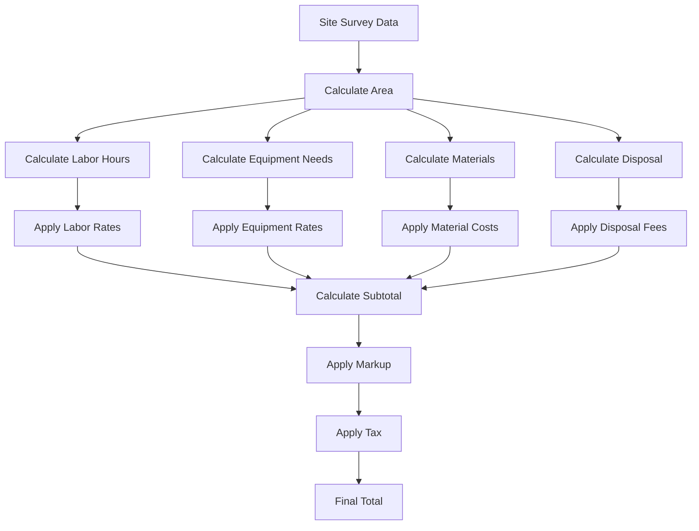
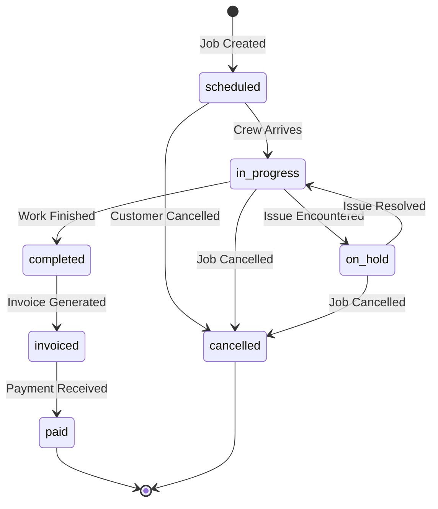
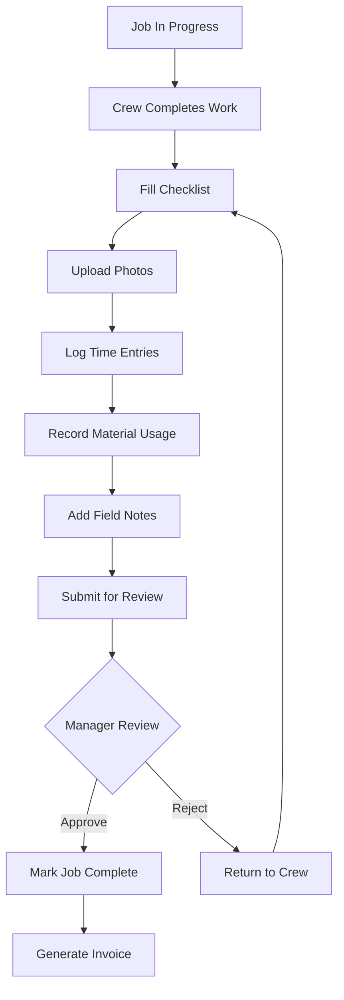
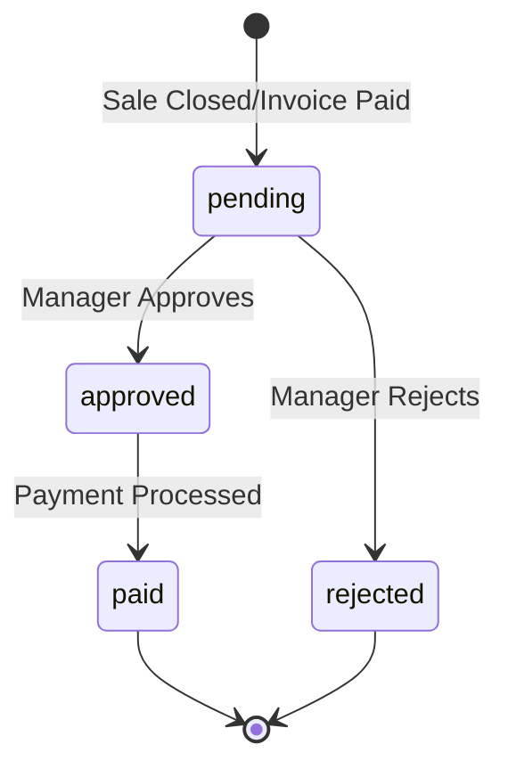
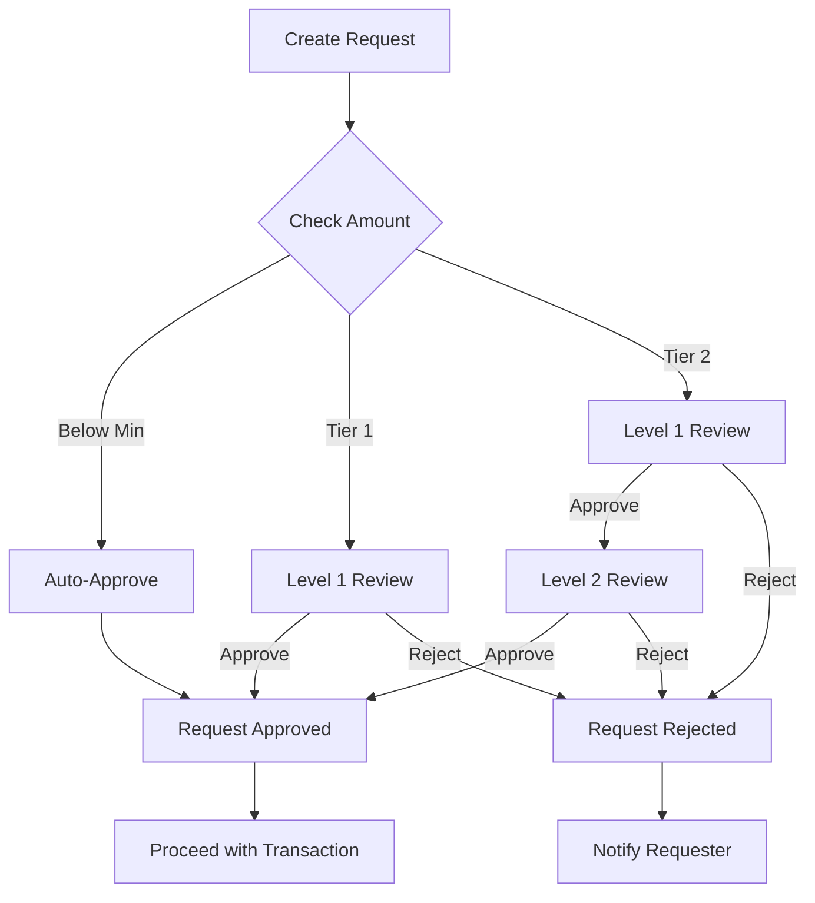
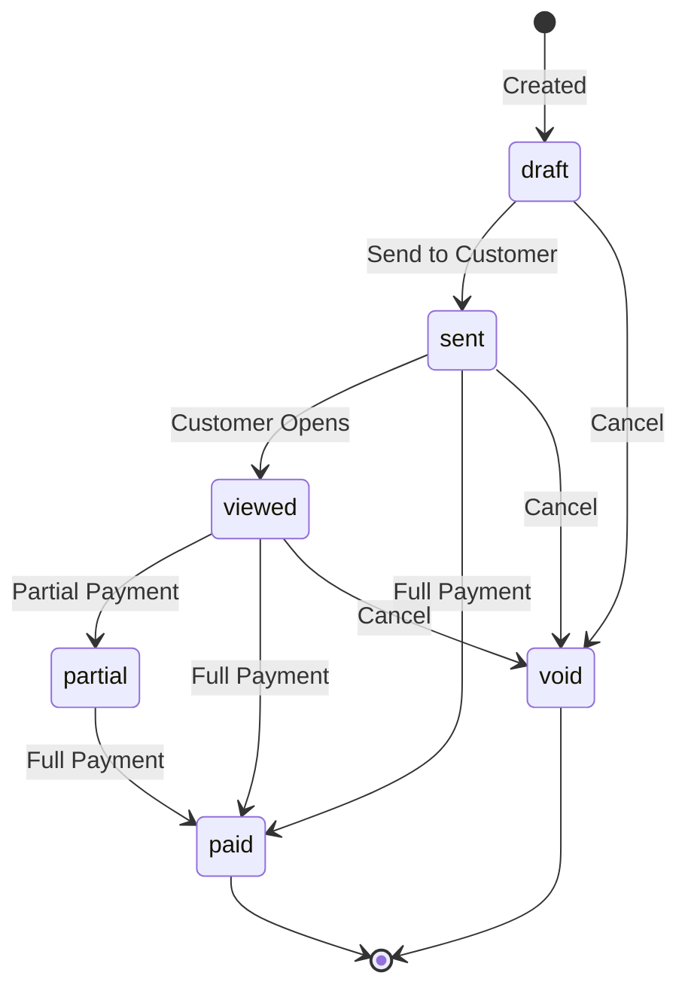
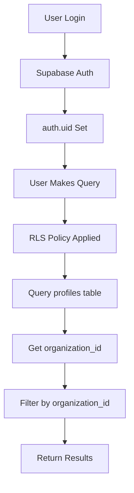

# HazardOS Business Logic Documentation

**Comprehensive guide to complex business rules, workflows, and domain logic**

> **Last Updated**: February 1, 2026
> **Version**: 0.2.1

---

## Table of Contents

1. [Estimate Calculation Logic](#estimate-calculation-logic)
2. [Job Lifecycle & Workflows](#job-lifecycle--workflows)
3. [Commission Calculation](#commission-calculation)
4. [Approval Workflows](#approval-workflows)
5. [Sales Pipeline Logic](#sales-pipeline-logic)
6. [Invoice Generation](#invoice-generation)
7. [Multi-Tenant Data Isolation](#multi-tenant-data-isolation)
8. [SMS & Notification Logic](#sms--notification-logic)

---

## Estimate Calculation Logic

**Service**: `lib/services/estimate-calculator.ts`

### Overview

The estimate calculator generates detailed cost estimates for hazardous material remediation projects. It uses industry-specific formulas, material requirements, and labor standards to calculate accurate project costs.

### Why This Exists

Manual estimate creation is error-prone and time-consuming. The calculator:
- Ensures consistent pricing across all estimates
- Automatically calculates labor hours based on project parameters
- Matches material quantities to industry standards
- Factors in equipment rental durations
- Applies organization-specific markups and pricing

### Core Calculation Flow



### Labor Calculation

**Formula**: `Total Hours = Area (sqft) × Hours per Sqft × Crew Size`

**Hours per Square Foot by Hazard Type and Containment Level**:

```typescript
const LABOR_HOURS_PER_SQFT = {
  asbestos: { 1: 0.15, 2: 0.25, 3: 0.35, 4: 0.5 },
  mold:     { 1: 0.10, 2: 0.20, 3: 0.30, 4: 0.4 },
  lead:     { 1: 0.12, 2: 0.22, 3: 0.32, 4: 0.42 },
  vermiculite: { 1: 0.20, 2: 0.30, 3: 0.40, 4: 0.5 }
}
```

**Why These Rates?**
- Containment Level 1 (Minimal): Basic containment, faster work
- Containment Level 4 (Full): Complete isolation, slower work, more safety protocols
- Asbestos requires more time due to regulatory compliance and safety requirements
- Mold remediation is generally faster with proper containment

**Crew Size by Containment Level**:
- Level 1: 2 workers (1 supervisor + 1 technician)
- Level 2: 3 workers (1 supervisor + 2 technicians)
- Level 3: 4 workers (1 supervisor + 3 technicians)
- Level 4: 5 workers (1 supervisor + 4 technicians)

**Example Labor Calculation**:
```
Project: 500 sqft asbestos removal, Level 3 containment
Hours per sqft: 0.35
Crew size: 4
Total hours: 500 × 0.35 = 175 hours

Labor breakdown:
- Supervisor: 175 hrs × $85/hr = $14,875
- Technicians (3): 175 × 3 = 525 hrs × $55/hr = $28,875
Total Labor: $43,750
```

### Equipment Calculation

**Logic**: Equipment needs are determined by hazard type and project duration.

**Equipment by Hazard Type**:
```typescript
const EQUIPMENT_BY_HAZARD = {
  asbestos: [
    'HEPA Vacuum',
    'Negative Air Machine',
    'Decontamination Unit',
    'Air Monitoring Equipment'
  ],
  mold: [
    'HEPA Vacuum',
    'Air Scrubber',
    'Dehumidifier',
    'Moisture Meter'
  ]
}
```

**Duration Calculation**: `Estimated Days = max(Containment Level, 2)`

**Why?**
- Equipment is rented by the day
- Minimum 2-day rental for most jobs
- More complex containment = longer project = more rental days
- Equipment must remain on-site until clearance testing complete

**Example Equipment Calculation**:
```
Project: Level 3 asbestos removal
Estimated days: max(3, 2) = 3 days

Equipment costs:
- HEPA Vacuum: 3 days × $75/day = $225
- Negative Air Machine: 3 days × $150/day = $450
- Decontamination Unit: 3 days × $200/day = $600
- Air Monitoring: 3 days × $100/day = $300
Total Equipment: $1,575
```

### Material Calculation

**Logic**: Materials are calculated based on square footage and project requirements.

**Material Requirements per Hazard Type**:
```typescript
const MATERIALS_BY_HAZARD = {
  asbestos: [
    { name: 'Poly Sheeting (6 mil)', qtyPerSqft: 1.5, unit: 'sqft' },
    { name: 'Duct Tape', qtyPerSqft: 0.1, unit: 'roll' },
    { name: 'Disposal Bags (6 mil)', qtyPerSqft: 0.02, unit: 'each' },
    { name: 'Warning Labels', qtyPerSqft: 0.01, unit: 'each' },
    { name: 'Tyvek Suits', qtyPerSqft: 0.005, unit: 'each' },
    { name: 'Respirator Filters', qtyPerSqft: 0.01, unit: 'pair' }
  ]
}
```

**Why 1.5x Poly Sheeting for Asbestos?**
- 1x for containment area coverage
- 0.5x for overlap, critical barriers, and decon unit flooring
- Regulatory requirement for double-layer critical barriers
- Waste factor for cuts and damaged sections

**Example Material Calculation**:
```
Project: 500 sqft asbestos removal

Materials:
- Poly Sheeting: 500 × 1.5 = 750 sqft × $0.50 = $375
- Duct Tape: 500 × 0.1 = 50 rolls × $8.00 = $400
- Disposal Bags: 500 × 0.02 = 10 bags × $5.00 = $50
- Warning Labels: 500 × 0.01 = 5 labels × $0.50 = $2.50
- Tyvek Suits: 500 × 0.005 = 2.5 ≈ 3 suits × $12.00 = $36
- Respirator Filters: 500 × 0.01 = 5 pairs × $15.00 = $75
Total Materials: $938.50
```

### Disposal Calculation

**Logic**: Waste volume is calculated based on hazard type and project area.

**Disposal Volume Multipliers** (cubic yards per sqft):
```typescript
const DISPOSAL_MULTIPLIER = {
  asbestos: 0.05,     // Dense material, minimal compaction
  mold: 0.03,         // Lightweight, more compaction
  lead: 0.02,         // Paint chips, smaller volume
  vermiculite: 0.08   // Insulation, high volume
}
```

**Why These Multipliers?**
- Based on material density and expansion during removal
- Includes space for containment materials (poly, PPE) in disposal
- Accounts for airgap in disposal bags (can't be fully compressed)
- Regulatory requirement for proper bag fill levels (typically 2/3 full max)

**Disposal Cost Factors**:
- Hazardous waste disposal fees
- Transportation to licensed facility
- Manifest documentation
- Landfill gate fees

**Example Disposal Calculation**:
```
Project: 500 sqft asbestos removal
Multiplier: 0.05 cu yd per sqft
Waste volume: 500 × 0.05 = 25 cubic yards

Disposal cost: 25 cu yd × $450/cu yd = $11,250

Why $450/cu yd for asbestos?
- Licensed landfill gate fee: ~$300/cu yd
- Transportation: ~$100/cu yd
- Manifesting and handling: ~$50/cu yd
```

### Markup and Margin Logic

**Markup vs. Margin**: Critical distinction in pricing.

**Markup Formula**: `Markup = Subtotal × (Markup % / 100)`
- Applied to cost to determine selling price
- Example: $100 cost + 20% markup = $120 selling price

**Margin Formula**: `Margin = (Selling Price - Cost) / Selling Price × 100`
- Percentage of selling price that is profit
- Example: $120 selling price - $100 cost = $20 profit / $120 = 16.67% margin

**Why Use Markup Instead of Margin?**
- Easier to calculate in code
- More intuitive for field staff
- Industry standard in construction
- Markup percentages directly configurable per organization

**Default Markup Settings**:
```typescript
{
  default_markup_percentage: 20,  // 20% markup on all costs
  labor_markup: 20,               // Can be customized per category
  materials_markup: 35,           // Higher markup on materials
  equipment_markup: 15,           // Lower markup on pass-through costs
  disposal_markup: 10             // Minimal markup on required fees
}
```

**Example Final Calculation**:
```
Subtotal breakdown:
- Labor: $43,750
- Equipment: $1,575
- Materials: $938.50
- Disposal: $11,250
Subtotal: $57,513.50

Markup (20%): $57,513.50 × 0.20 = $11,502.70

Tax (varies by jurisdiction): $0 (many states exempt remediation)

Final Total: $57,513.50 + $11,502.70 = $69,016.20

Margin check: ($69,016.20 - $57,513.50) / $69,016.20 = 16.67%
```

### Area Estimation Logic

**Challenge**: Site surveys may measure area in different ways.

**Fallback Hierarchy**:
1. **Preferred**: Direct square footage measurement
2. **Linear feet**: Convert assuming 2ft width (for pipe/duct work)
   ```typescript
   estimatedSqft = linearFt × 2
   ```
3. **Volume**: Convert assuming 8ft ceiling height
   ```typescript
   estimatedSqft = volumeCuft / 8
   ```
4. **Default**: Use 100 sqft minimum for small projects

**Why This Hierarchy?**
- Square footage is most accurate for area-based work
- Linear feet common for pipe insulation (2ft wrap around circumference)
- Volume used for attic/crawlspace where height varies
- 100 sqft minimum prevents unrealistic estimates for small jobs

### Optional Add-Ons

**Testing/Clearance**:
```typescript
if (survey.clearance_required) {
  const sampleCount = Math.max(Math.ceil(areaSqft / 500), 3)
  // Minimum 3 samples, add 1 per 500 sqft
}
```

**Why Sample Density?**
- Regulatory requirement: minimum 3 samples regardless of area
- Additional samples for large areas ensure comprehensive clearance
- 500 sqft per sample based on EPA guidelines

**Permit Fees**:
- EPA notification fees (asbestos, lead)
- State permit fees
- Local municipality fees
- Vary by hazard type and jurisdiction

---

## Job Lifecycle & Workflows

**Service**: `lib/services/jobs-service.ts`, `lib/services/job-completion-service.ts`

### Overview

Jobs progress through distinct lifecycle stages from scheduling to payment. Each transition involves business rules, validations, and automated actions.

### Job Status States



**Status Definitions**:

- **scheduled**: Job created, date/time assigned, crew not yet on-site
- **in_progress**: Crew has started work on-site
- **on_hold**: Work paused due to issue (weather, access, materials, etc.)
- **completed**: All work finished, ready for invoicing
- **invoiced**: Invoice generated and sent to customer
- **paid**: Payment received in full
- **cancelled**: Job cancelled by customer or company

### Job Creation from Proposal

**Why This Matters**: Jobs created from accepted proposals must inherit all relevant data while maintaining referential integrity.

**Process**:
```typescript
async createFromProposal(input: CreateJobFromProposalInput): Promise<Job> {
  // 1. Fetch proposal with all related data
  const proposal = await fetchProposalWithRelations(input.proposal_id)

  // 2. Extract nested data (handles Supabase array returns)
  const estimate = extractEstimate(proposal.estimate)
  const survey = extractSurvey(estimate?.site_survey)
  const customer = extractCustomer(proposal.customer)

  // 3. Create job with inherited data
  const job = await JobsService.create({
    proposal_id: proposal.id,
    customer_id: proposal.customer_id,
    scheduled_start_date: input.scheduled_start_date,
    scheduled_start_time: input.scheduled_start_time,

    // Inherit from survey
    job_address: survey?.site_address || customer?.address_line1,
    hazard_types: survey?.hazard_type ? [survey.hazard_type] : [],
    access_notes: survey?.access_info?.notes,

    // Financial data from proposal
    contract_amount: proposal.total,
    final_amount: proposal.total
  })

  // 4. Update proposal status
  await updateProposalStatus(proposal.id, 'converted')

  // 5. Schedule customer reminders
  await scheduleReminders(job.id)

  return job
}
```

**Why Extract Nested Data?**
- Supabase returns related data as arrays even for single relations
- Must handle both `estimate` and `estimate[0]` formats
- Defensive programming prevents runtime errors
- Type safety maintained through extraction functions

### Status Transition Logic

**Business Rules for Status Changes**:

**scheduled → in_progress**:
- Can only happen on or after scheduled start date
- Captures `actual_start_at` timestamp
- Triggers SMS notification to customer ("We're on our way!")
- Updates crew availability status

**in_progress → on_hold**:
- Requires reason code (weather, materials, access, safety)
- Adds note to job explaining hold reason
- Notifies office staff
- Pauses time tracking

**on_hold → in_progress**:
- Requires resolution note
- Resumes time tracking
- Updates customer if timeline affected

**in_progress → completed**:
- Requires job completion checklist to be filled
- All time entries must be submitted
- Material usage must be recorded
- Photos must be uploaded
- Creates completion record for manager review

**completed → invoiced**:
- Generates invoice from job data
- Includes approved change orders
- Locks job data (no further time/material edits)
- Sends invoice to customer

**invoiced → paid**:
- Payment must be recorded
- Updates accounts receivable
- Triggers commission calculation for sales rep
- Sends thank-you message to customer

### Job Reminders

**Why**: Reduce no-shows and ensure customers are prepared.

**Reminder Schedule**:
```typescript
const reminders = [
  { days: 7, type: 'job_7day', template: 'job_reminder_7day' },
  { days: 3, type: 'job_3day', template: 'job_reminder_3day' },
  { days: 1, type: 'job_1day', template: 'job_reminder_1day' }
]
```

**Scheduling Logic**:
```typescript
async scheduleReminders(jobId: string): Promise<void> {
  const job = await getJob(jobId)
  const scheduledDate = new Date(job.scheduled_start_date)

  for (const reminder of reminders) {
    const reminderDate = new Date(scheduledDate)
    reminderDate.setDate(reminderDate.getDate() - reminder.days)
    reminderDate.setHours(9, 0, 0, 0) // 9 AM on reminder day

    // Only schedule if in the future
    if (reminderDate > new Date()) {
      await createScheduledReminder({
        related_type: 'job',
        related_id: jobId,
        reminder_type: reminder.type,
        scheduled_for: reminderDate,
        template_slug: reminder.template,
        recipient_email: customer.email,
        recipient_phone: customer.phone,
        template_variables: {
          customer_name: customer.name,
          scheduled_date: formatDate(job.scheduled_start_date),
          scheduled_time: job.scheduled_start_time,
          property_address: job.job_address,
          job_number: job.job_number
        }
      })
    }
  }
}
```

**Why 9 AM?**
- Business hours (not too early)
- Gives customer time to respond same day
- Aligns with office staff availability

**Reminder Cancellation**:
```typescript
// If job is cancelled or rescheduled
await cancelReminders(jobId)

// If rescheduled
await rescheduleReminders(jobId) // Cancels old, creates new
```

### Job Completion Workflow

**Purpose**: Ensure all work is properly documented before invoicing.



**Completion Checklist Categories**:

1. **Safety** (Required)
   - PPE used properly
   - Safety perimeter maintained
   - Air quality monitored
   - No incidents reported

2. **Quality** (Required)
   - Work meets specifications
   - Materials properly contained
   - Area clearance testing passed

3. **Cleanup** (Required)
   - Work area cleaned
   - Equipment decontaminated
   - Waste properly bagged
   - Disposal manifests completed

4. **Documentation** (Required)
   - Before photos taken
   - After photos taken
   - Time entries complete
   - Material usage recorded

**Why Checklist is Required**:
- Regulatory compliance (EPA, OSHA)
- Quality assurance
- Liability protection
- Prevents incomplete jobs from being invoiced
- Ensures proper documentation for disputes

### Change Orders

**Definition**: Changes to original scope, timeline, or cost during job execution.

**Change Order Workflow**:
```typescript
async addChangeOrder(jobId: string, input: CreateChangeOrderInput) {
  const changeOrder = await createChangeOrder({
    job_id: jobId,
    description: input.description,
    amount: input.amount,
    reason: input.reason, // scope_change, additional_work, unforeseen
    status: 'pending',
    requested_by: currentUser.id,
    requested_at: new Date()
  })

  // Notify office for approval
  await notifyChangeOrderCreated(changeOrder)

  return changeOrder
}

async approveChangeOrder(changeOrderId: string) {
  const changeOrder = await updateChangeOrder(changeOrderId, {
    status: 'approved',
    approved_by: currentUser.id,
    approved_at: new Date()
  })

  // Update job contract amount
  const job = await getJob(changeOrder.job_id)
  await updateJob(job.id, {
    contract_amount: job.contract_amount + changeOrder.amount
  })

  // Notify customer
  await notifyCustomerChangeOrderApproved(changeOrder)

  return changeOrder
}
```

**Why Approval Required?**
- Protects company from unauthorized scope changes
- Ensures customer is informed of additional costs
- Maintains accurate job costing
- Creates audit trail for disputes

---

## Commission Calculation

**Service**: `lib/services/commission-service.ts`

### Overview

Automated commission tracking for sales team compensation. Commissions are calculated when deals close or invoices are paid, depending on organization settings.

### Commission Plan Types

**1. Percentage Commission**:
```typescript
{
  commission_type: 'percentage',
  base_rate: 5, // 5% of sale amount
  applies_to: 'won' // Calculate when opportunity won
}
```

**Calculation**:
```typescript
commissionAmount = saleAmount × (baseRate / 100)
// Example: $10,000 sale × 5% = $500 commission
```

**2. Flat Rate Commission**:
```typescript
{
  commission_type: 'flat',
  base_rate: 500, // $500 per sale
  applies_to: 'paid' // Calculate when invoice paid
}
```

**Calculation**:
```typescript
commissionAmount = baseRate
// Example: $500 regardless of sale amount
```

**3. Tiered Commission**:
```typescript
{
  commission_type: 'tiered',
  tiers: [
    { min: 0, max: 10000, rate: 3 },      // 3% on first $10k
    { min: 10001, max: 25000, rate: 5 },  // 5% on $10k-$25k
    { min: 25001, max: null, rate: 7 }    // 7% above $25k
  ],
  applies_to: 'won'
}
```

**Calculation**:
```typescript
function calculateTieredCommission(amount: number, tiers: Tier[]): number {
  // Find applicable tier
  const tier = tiers.find(t =>
    amount >= t.min && (t.max === null || amount <= t.max)
  )

  return amount × (tier.rate / 100)
}

// Example: $30,000 sale
// Falls in tier 3 (min: 25001, max: null, rate: 7%)
// Commission: $30,000 × 7% = $2,100
```

**Why Tiered?**
- Incentivizes larger deals
- Progressive reward for higher performers
- Common in sales compensation
- Aligns rep incentives with company goals

### Commission Workflow



**Status Definitions**:

- **pending**: Commission created, awaiting manager review
- **approved**: Manager approved, ready for payment
- **paid**: Commission paid to sales rep
- **rejected**: Manager rejected (rare, typically for disputes)

### Automatic Commission Creation

**Trigger Points**:

**Option 1: On Opportunity Won**:
```typescript
async markOpportunityWon(opportunityId: string) {
  const opportunity = await getOpportunity(opportunityId)

  // Update opportunity
  await updateOpportunity(opportunityId, {
    outcome: 'won',
    actual_close_date: new Date()
  })

  // Get sales rep's commission plan
  const plan = await getCommissionPlan(opportunity.owner_id)

  if (plan.applies_to === 'won') {
    // Create commission earning
    await createCommissionEarning({
      user_id: opportunity.owner_id,
      plan_id: plan.id,
      opportunity_id: opportunityId,
      base_amount: opportunity.estimated_value,
      status: 'pending'
    })
  }
}
```

**Option 2: On Invoice Paid**:
```typescript
async recordPayment(invoiceId: string, payment: PaymentInput) {
  const invoice = await getInvoice(invoiceId)

  // Record payment
  await createPayment({
    invoice_id: invoiceId,
    amount: payment.amount,
    payment_date: payment.payment_date
  })

  // If invoice is now fully paid
  if (invoice.balance_due === 0) {
    // Get sales rep from job
    const job = await getJob(invoice.job_id)
    const opportunity = await getOpportunityByJob(job.id)

    // Get commission plan
    const plan = await getCommissionPlan(opportunity.owner_id)

    if (plan.applies_to === 'paid') {
      // Create commission earning
      await createCommissionEarning({
        user_id: opportunity.owner_id,
        plan_id: plan.id,
        invoice_id: invoiceId,
        base_amount: invoice.total,
        status: 'pending'
      })
    }
  }
}
```

**Why Two Options?**
- **On Won**: Cash flow advantage, motivates closers
- **On Paid**: Reduces risk of unpaid invoices, aligns with revenue recognition
- Organization chooses based on their sales culture and cash flow

### Commission Approval Logic

**Why Approval Required?**
- Verify sale is legitimate (not a test/demo)
- Confirm customer payment (if applies_to: 'paid')
- Check for customer disputes or quality issues
- Ensure rep followed company policies
- Protect against commission fraud

**Approval Process**:
```typescript
async approveCommission(commissionId: string): Promise<void> {
  const { data: { user } } = await supabase.auth.getUser()

  // Check approver has permission
  const profile = await getProfile(user.id)
  if (!['admin', 'owner'].includes(profile.role)) {
    throw new Error('Insufficient permissions')
  }

  // Update commission status
  await updateCommission(commissionId, {
    status: 'approved',
    approved_by: user.id,
    approved_at: new Date()
  })

  // Notify sales rep
  await notifyCommissionApproved(commissionId)
}
```

### Bulk Payment Processing

**Use Case**: Process monthly commission payments for entire sales team.

```typescript
async bulkMarkPaid(commissionIds: string[]): Promise<void> {
  // Only mark approved commissions as paid
  await supabase
    .from('commission_earnings')
    .update({
      status: 'paid',
      paid_at: new Date()
    })
    .in('id', commissionIds)
    .eq('status', 'approved') // Safety check
}
```

**Why Bulk?**
- Efficiency (pay all reps at once, typically monthly)
- Consistency (all paid on same date)
- Integration with payroll systems
- Reduces admin overhead

### Commission Summary Metrics

**Real-time Dashboard**:
```typescript
async getSummary(userId?: string): Promise<CommissionSummary> {
  return {
    total_pending: sumPending(userId),
    total_approved: sumApproved(userId),
    total_paid: sumPaid(userId),
    this_month: sumThisMonth(userId),
    this_quarter: sumThisQuarter(userId)
  }
}
```

**Why These Metrics?**
- **Pending**: Shows uncollected earnings
- **Approved**: Shows ready-to-pay amount
- **Paid**: Historical earnings
- **This Month**: Current period performance
- **This Quarter**: Tracks toward quarterly quotas

---

## Approval Workflows

**Service**: `lib/services/approval-service.ts`

### Overview

Two-level hierarchical approval system for financial transactions and discounts. Ensures proper authorization for significant business decisions.

### Threshold-Based Routing

**Concept**: Approval requirements scale with transaction value.

**Threshold Configuration**:
```typescript
interface ApprovalThreshold {
  entity_type: 'estimate' | 'discount' | 'proposal' | 'change_order'
  threshold_amount: number
  approval_level: 1 | 2
  approver_role?: string
}
```

**Example Thresholds**:
```typescript
// Estimates
{ entity_type: 'estimate', threshold_amount: 5000, approval_level: 1 }
{ entity_type: 'estimate', threshold_amount: 15000, approval_level: 2 }

// Discounts (percentage-based)
{ entity_type: 'discount', threshold_amount: 10, approval_level: 1 }
{ entity_type: 'discount', threshold_amount: 20, approval_level: 2 }
```

**Why Thresholds?**
- Empowers staff for routine decisions
- Escalates high-value decisions to senior management
- Balances efficiency with financial control
- Reduces bottlenecks for small transactions
- Creates audit trail for large commitments

### Two-Level Approval Flow



**Level 1 Approval**:
- Typically manager/supervisor level
- Reviews moderate-value transactions
- Can approve independently if no Level 2 needed
- Can reject without Level 2 review

**Level 2 Approval**:
- Typically director/owner level
- Only triggered if Level 1 approves AND amount exceeds Level 2 threshold
- Final approval authority
- Reviews highest-value transactions

### Approval Request Creation

**Automatic Creation**:
```typescript
async createEstimate(input: CreateEstimateInput) {
  const estimate = await insertEstimate(input)

  // Check if approval needed
  const needsApproval = await ApprovalService.checkNeedsApproval(
    'estimate',
    estimate.total
  )

  if (needsApproval) {
    // Create approval request
    const request = await ApprovalService.createRequest({
      entity_type: 'estimate',
      entity_id: estimate.id,
      amount: estimate.total
    })

    // Notify Level 1 approver
    await notifyApprovalNeeded(request)

    // Lock estimate from editing
    await updateEstimate(estimate.id, {
      approval_required: true,
      approval_request_id: request.id
    })
  }

  return estimate
}
```

**Why Auto-Create?**
- Prevents circumventing approval process
- Ensures consistent application of rules
- Reduces manual admin work
- Creates audit trail from point of creation

### Approval Decision Logic

**Level 1 Decision**:
```typescript
async decideLevel1(requestId: string, decision: ApprovalDecisionInput) {
  const request = await getRequest(requestId)
  const newStatus = decision.approved ? 'approved' : 'rejected'

  // Determine final status
  let finalStatus: ApprovalStatus = newStatus
  if (decision.approved && request.requires_level2) {
    finalStatus = 'pending' // Still need Level 2
  }

  await updateRequest(requestId, {
    level1_status: newStatus,
    level1_approver: currentUser.id,
    level1_at: new Date(),
    level1_notes: decision.notes,
    final_status: finalStatus
  })

  // Notify based on outcome
  if (finalStatus === 'pending') {
    // Notify Level 2 approver
    await notifyLevel2ApprovalNeeded(requestId)
  } else if (finalStatus === 'approved') {
    // Notify requester
    await notifyApprovalGranted(requestId)
  } else {
    // Notify requester of rejection
    await notifyApprovalRejected(requestId)
  }
}
```

**Level 2 Decision**:
```typescript
async decideLevel2(requestId: string, decision: ApprovalDecisionInput) {
  const request = await getRequest(requestId)

  // Validate Level 1 was approved
  if (request.level1_status !== 'approved') {
    throw new Error('Level 1 must be approved before Level 2')
  }

  const finalStatus = decision.approved ? 'approved' : 'rejected'

  await updateRequest(requestId, {
    level2_status: finalStatus,
    level2_approver: currentUser.id,
    level2_at: new Date(),
    level2_notes: decision.notes,
    final_status: finalStatus // Level 2 is final
  })

  // Notify requester
  if (finalStatus === 'approved') {
    await notifyApprovalGranted(requestId)
  } else {
    await notifyApprovalRejected(requestId)
  }
}
```

**Why Validate Level 1?**
- Enforces hierarchy (can't skip Level 1)
- Prevents race conditions
- Ensures proper review chain
- Maintains audit trail integrity

### Entity-Specific Approval Logic

**Estimates**:
- Block conversion to proposal until approved
- Show approval status on estimate
- Link to approval request for status tracking

**Discounts**:
- Percentage-based thresholds
- Applied at line-item or total level
- Reason required for large discounts
- Historical discount tracking per customer

**Proposals**:
- Check before sending to customer
- Block e-signature until approved
- Display approval status in customer view

**Change Orders**:
- Required for scope changes on active jobs
- Amount threshold typically lower than estimates
- Fast-track approval for safety-related changes

### Approval Queue

**Manager View**:
```typescript
async getMyPendingApprovals(): Promise<ApprovalRequest[]> {
  const profile = await getCurrentProfile()
  const isAdmin = ['admin', 'owner'].includes(profile.role)

  // Get all pending requests
  const requests = await getPendingRequests()

  // Filter to requests this user can approve
  return requests.filter(request => {
    // Admins can approve anything
    if (isAdmin) return true

    // Level 1 pending and not yet approved
    if (request.level1_status === 'pending') return true

    // Level 2 pending and level 1 approved (admin only)
    if (
      request.level1_status === 'approved' &&
      request.requires_level2 &&
      request.level2_status === 'pending' &&
      isAdmin
    ) {
      return true
    }

    return false
  })
}
```

**Why Filter by Role?**
- Shows only actionable items
- Prevents confusion about who should approve
- Enforces permission boundaries
- Improves user experience (no clutter)

---

## Sales Pipeline Logic

**Service**: `lib/services/pipeline-service.ts`

### Overview

Visual sales pipeline with probability-weighted forecasting. Opportunities progress through customizable stages from lead to closed deal.

### Pipeline Stages

**Default Stage Configuration**:
```typescript
const DEFAULT_STAGES = [
  { name: 'Lead', probability: 0, stage_type: 'open', sort_order: 1 },
  { name: 'Qualified', probability: 20, stage_type: 'open', sort_order: 2 },
  { name: 'Proposal', probability: 40, stage_type: 'open', sort_order: 3 },
  { name: 'Negotiation', probability: 60, stage_type: 'open', sort_order: 4 },
  { name: 'Verbal Commit', probability: 80, stage_type: 'open', sort_order: 5 },
  { name: 'Won', probability: 100, stage_type: 'won', sort_order: 6 },
  { name: 'Lost', probability: 0, stage_type: 'lost', sort_order: 7 }
]
```

**Stage Type Definitions**:
- **open**: Active opportunity, still in sales process
- **won**: Deal closed successfully
- **lost**: Deal lost to competitor or cancelled

**Why Probability Percentages?**
- Enables weighted pipeline forecasting
- Based on historical conversion rates
- Helps predict revenue
- Guides resource allocation

**Probability Meaning**:
```
Lead (0%): Just entered pipeline, not qualified
Qualified (20%): 1 in 5 qualified leads close
Proposal (40%): 2 in 5 proposals accepted
Negotiation (60%): 3 in 5 negotiations succeed
Verbal Commit (80%): 4 in 5 verbal commits convert to signed deals
```

### Weighted Value Calculation

**Purpose**: More accurate revenue forecasting than simple opportunity sum.

**Formula**:
```typescript
weightedValue = estimatedValue × (stageProbability / 100)
```

**Example**:
```typescript
const opportunities = [
  { name: 'Acme Corp', value: 50000, stage: 'Proposal', probability: 40 },
  { name: 'XYZ Inc', value: 30000, stage: 'Negotiation', probability: 60 },
  { name: 'ABC Ltd', value: 20000, stage: 'Verbal', probability: 80 }
]

// Simple sum: $100,000
// Weighted sum:
//   $50,000 × 40% = $20,000
//   $30,000 × 60% = $18,000
//   $20,000 × 80% = $16,000
// Total weighted: $54,000
```

**Why Weighted?**
- More realistic revenue forecast
- Accounts for deal risk
- Helps identify pipeline gaps
- Guides sales strategy

### Opportunity Movement

**Drag-and-Drop Logic**:
```typescript
async moveOpportunity(
  opportunityId: string,
  newStageId: string,
  notes?: string
): Promise<Opportunity> {
  const opportunity = await getOpportunity(opportunityId)
  const oldStage = opportunity.stage
  const newStage = await getStage(newStageId)

  // Calculate new weighted value
  const weightedValue = opportunity.estimated_value
    ? opportunity.estimated_value × (newStage.probability / 100)
    : null

  // Determine outcome based on stage type
  const outcome =
    newStage.stage_type === 'won' ? 'won' :
    newStage.stage_type === 'lost' ? 'lost' :
    null

  // Update opportunity
  await updateOpportunity(opportunityId, {
    stage_id: newStageId,
    weighted_value: weightedValue,
    outcome,
    actual_close_date: outcome ? new Date() : null
  })

  // Record history
  await createHistory({
    opportunity_id: opportunityId,
    from_stage_id: oldStage.id,
    to_stage_id: newStageId,
    changed_by: currentUser.id,
    notes
  })

  // Log activity
  await Activity.statusChanged(
    'opportunity',
    opportunityId,
    opportunity.name,
    oldStage.name,
    newStage.name
  )

  // Trigger automations
  if (outcome === 'won') {
    await handleOpportunityWon(opportunityId)
  } else if (outcome === 'lost') {
    await handleOpportunityLost(opportunityId)
  }

  return opportunity
}
```

**Why Record History?**
- Audit trail of all movements
- Sales velocity analysis (time in each stage)
- Identify bottlenecks
- Sales rep performance tracking
- Deal forensics for lost opportunities

### Win/Loss Tracking

**Won Opportunities**:
```typescript
async handleOpportunityWon(opportunityId: string) {
  const opportunity = await getOpportunity(opportunityId)

  // Update metrics
  await updateOpportunity(opportunityId, {
    outcome: 'won',
    actual_close_date: new Date(),
    actual_value: opportunity.estimated_value
  })

  // Calculate commission
  await CommissionService.createEarning({
    user_id: opportunity.owner_id,
    opportunity_id: opportunityId,
    base_amount: opportunity.estimated_value
  })

  // Request customer testimonial
  await requestTestimonial(opportunity.customer_id)

  // Notify team
  await notifyOpportunityWon(opportunity)
}
```

**Lost Opportunities**:
```typescript
interface LossDetails {
  loss_reason:
    | 'price_too_high'
    | 'lost_to_competitor'
    | 'timeline'
    | 'budget_cut'
    | 'project_cancelled'
    | 'no_decision'
    | 'internal_solution'
    | 'other'
  loss_notes?: string
  competitor?: string
}

async handleOpportunityLost(
  opportunityId: string,
  details: LossDetails
) {
  await updateOpportunity(opportunityId, {
    outcome: 'lost',
    actual_close_date: new Date(),
    loss_reason: details.loss_reason,
    loss_notes: details.loss_notes,
    competitor: details.competitor
  })

  // Update competitor intelligence
  if (details.competitor) {
    await trackCompetitorWin(details.competitor, opportunityId)
  }

  // Analyze loss reasons
  await analyzeLossPatterns(details.loss_reason)
}
```

**Why Track Loss Details?**
- Identify patterns in losses
- Competitive intelligence
- Pricing strategy adjustments
- Process improvements
- Sales training opportunities

### Pipeline Metrics

**Key Metrics**:
```typescript
interface PipelineMetrics {
  total_value: number          // Sum of all opportunity values
  weighted_value: number        // Probability-weighted forecast
  count: number                 // Total opportunities
  by_stage: StageMetrics[]      // Breakdown per stage
}

interface StageMetrics {
  stage_id: string
  stage_name: string
  count: number                 // Opportunities in this stage
  value: number                 // Sum of values in this stage
  weighted_value: number        // Probability-weighted value
  avg_age_days: number          // Average days in this stage
  conversion_rate: number       // % that move to next stage
}
```

**Why These Metrics?**
- **Total Value**: Upside potential
- **Weighted Value**: Realistic forecast
- **Count**: Pipeline health indicator
- **By Stage**: Identifies bottlenecks and gaps
- **Avg Age**: Spots stalled deals
- **Conversion Rate**: Process effectiveness

---

## Invoice Generation

**Service**: `lib/services/invoices-service.ts`

### Overview

Automated invoice creation from completed jobs with line-item tracking and payment management. Integrates with job completion and QuickBooks sync.

### Invoice Creation from Job

**Why**: Ensures accurate billing based on actual work performed.

**Process**:
```typescript
async createFromJob(input: CreateInvoiceFromJobInput): Promise<Invoice> {
  // 1. Fetch job with all related data
  const job = await getJobWithDetails(input.job_id)

  // 2. Calculate due date
  const dueDate = new Date()
  dueDate.setDate(dueDate.getDate() + (input.due_days || 30))

  // 3. Create invoice
  const invoice = await createInvoice({
    job_id: input.job_id,
    customer_id: job.customer_id,
    due_date: dueDate.toISOString().split('T')[0],
    payment_terms: `Net ${input.due_days || 30}`
  })

  // 4. Build line items array
  const lineItems: AddLineItemInput[] = []

  // Add main job amount
  const jobAmount = job.final_amount || job.contract_amount
  lineItems.push({
    description: `Remediation services - Job #${job.job_number}`,
    quantity: 1,
    unit: 'job',
    unit_price: jobAmount,
    source_type: 'job',
    source_id: job.id
  })

  // Add approved change orders
  if (input.include_change_orders !== false) {
    const approvedCOs = job.change_orders.filter(
      co => co.status === 'approved'
    )

    for (const co of approvedCOs) {
      lineItems.push({
        description: `Change Order: ${co.description}`,
        quantity: 1,
        unit: 'each',
        unit_price: co.amount,
        source_type: 'change_order',
        source_id: co.id
      })
    }
  }

  // 5. Batch insert all line items (single query)
  await addLineItemsBatch(invoice.id, lineItems)

  // 6. Update job status
  await updateJob(input.job_id, {
    status: 'invoiced',
    updated_at: new Date()
  })

  return await getInvoice(invoice.id)
}
```

**Why Batch Insert Line Items?**
- Performance: 1 query instead of N queries
- Atomicity: All line items added or none
- Consistency: All get sequential sort_order
- Reduces database load

### Line Item Management

**Line Item Structure**:
```typescript
interface InvoiceLineItem {
  id: string
  invoice_id: string
  description: string
  quantity: number
  unit: string | null
  unit_price: number
  line_total: number        // quantity × unit_price
  source_type: string | null // 'job', 'change_order', 'custom'
  source_id: string | null
  sort_order: number
}
```

**Automatic Line Total Calculation**:
```typescript
async updateLineItem(id: string, updates: Partial<LineItem>) {
  // Recalculate line_total if quantity or unit_price changed
  if (updates.quantity !== undefined || updates.unit_price !== undefined) {
    const current = await getLineItem(id)
    const qty = updates.quantity ?? current.quantity ?? 1
    const price = updates.unit_price ?? current.unit_price ?? 0
    updates.line_total = qty * price
  }

  await updateLineItemRecord(id, updates)
}
```

**Why Calculate Line Total?**
- Consistency: Single source of truth
- Performance: Pre-calculated for invoice totals
- Simplicity: No need to calculate in queries
- Prevents rounding errors

### Invoice Status Transitions



**Status Definitions**:

- **draft**: Invoice created, not yet sent to customer
- **sent**: Invoice sent via email/SMS
- **viewed**: Customer opened invoice (tracked via link)
- **partial**: Partial payment received, balance remains
- **paid**: Full payment received
- **void**: Invoice cancelled (not deleted for audit trail)

**Status Transition Logic**:
```typescript
async send(invoiceId: string, method: 'email' | 'sms'): Promise<Invoice> {
  const invoice = await updateInvoice(invoiceId, {
    status: 'sent',
    sent_at: new Date(),
    sent_via: method
  })

  // Send email or SMS
  await sendInvoiceToCustomer(invoice, method)

  // Log activity
  await Activity.sent('invoice', invoiceId, invoice.invoice_number)

  return invoice
}

async markViewed(invoiceId: string): Promise<Invoice> {
  const invoice = await getInvoice(invoiceId)

  // Only update if currently 'sent'
  if (invoice.status === 'sent') {
    return await updateInvoice(invoiceId, {
      status: 'viewed',
      viewed_at: new Date()
    })
  }

  return invoice
}
```

**Why Track 'Viewed' Status?**
- Customer engagement tracking
- Follow-up timing (don't follow up until viewed)
- Delivery confirmation
- Prevents "I never received it" claims

### Payment Tracking

**Payment Recording**:
```typescript
async recordPayment(
  invoiceId: string,
  payment: RecordPaymentInput
): Promise<Payment> {
  const invoice = await getInvoice(invoiceId)

  // Create payment record
  const paymentRecord = await createPayment({
    invoice_id: invoiceId,
    amount: payment.amount,
    payment_date: payment.payment_date || new Date(),
    payment_method: payment.payment_method, // check, card, cash, ach
    reference_number: payment.reference_number,
    notes: payment.notes
  })

  // Update invoice totals (handled by database trigger)
  // - total_paid += payment.amount
  // - balance_due = total - total_paid
  // - status = 'paid' if balance_due = 0
  //   status = 'partial' if 0 < balance_due < total

  // Update job status if fully paid
  const updatedInvoice = await getInvoice(invoiceId)
  if (updatedInvoice.status === 'paid' && invoice.job_id) {
    await updateJob(invoice.job_id, { status: 'paid' })
  }

  // Log activity
  await Activity.paid(
    'invoice',
    invoiceId,
    invoice.invoice_number,
    payment.amount
  )

  // Calculate commission (if on 'paid' trigger)
  const job = await getJob(invoice.job_id)
  const opportunity = await getOpportunityByJob(job.id)
  await CommissionService.maybeCreateEarning(opportunity, invoice)

  return paymentRecord
}
```

**Why Database Trigger for Totals?**
- Atomic: Payment and total update in one transaction
- Consistent: Totals always accurate
- Simple: No manual total calculation
- Safe: Prevents race conditions

### Partial Payment Logic

**Use Case**: Large invoices paid in installments.

**Example**:
```
Invoice Total: $50,000
Payment 1: $20,000 (status: partial, balance: $30,000)
Payment 2: $15,000 (status: partial, balance: $15,000)
Payment 3: $15,000 (status: paid, balance: $0)
```

**Business Rules**:
- Status remains 'partial' until fully paid
- Can record any number of partial payments
- Balance automatically recalculated
- Each payment logged separately for accounting
- Commission only triggered on full payment (if configured)

**Database Trigger**:
```sql
CREATE OR REPLACE FUNCTION update_invoice_totals()
RETURNS TRIGGER AS $$
BEGIN
  -- Recalculate totals
  UPDATE invoices
  SET
    total_paid = (
      SELECT COALESCE(SUM(amount), 0)
      FROM payments
      WHERE invoice_id = NEW.invoice_id
    ),
    balance_due = total - (
      SELECT COALESCE(SUM(amount), 0)
      FROM payments
      WHERE invoice_id = NEW.invoice_id
    ),
    status = CASE
      WHEN total - (SELECT COALESCE(SUM(amount), 0)
                    FROM payments
                    WHERE invoice_id = NEW.invoice_id) = 0
      THEN 'paid'
      WHEN total - (SELECT COALESCE(SUM(amount), 0)
                    FROM payments
                    WHERE invoice_id = NEW.invoice_id) < total
      THEN 'partial'
      ELSE status
    END,
    updated_at = NOW()
  WHERE id = NEW.invoice_id;

  RETURN NEW;
END;
$$ LANGUAGE plpgsql;

CREATE TRIGGER payment_recorded
  AFTER INSERT ON payments
  FOR EACH ROW
  EXECUTE FUNCTION update_invoice_totals();
```

---

## Multi-Tenant Data Isolation

**Schema**: `supabase/migrations/*rls*.sql`

### Overview

Row-Level Security (RLS) policies ensure complete data isolation between organizations. No organization can access another's data, even with direct database access.

### Why RLS?

**Alternative Approaches**:
1. **Application-level filtering**: Add `WHERE organization_id = ?` to every query
   - ❌ Error-prone (easy to forget)
   - ❌ Security risk if one query misses filter
   - ❌ Requires careful code review

2. **Separate databases per tenant**: Each organization gets own database
   - ❌ Expensive (infrastructure per org)
   - ❌ Complex (schema migrations multiplied)
   - ❌ Doesn't scale

3. **Row-Level Security**: Database enforces isolation
   - ✅ Can't be bypassed
   - ✅ Applied automatically to all queries
   - ✅ Single database, proven at scale
   - ✅ Even platform admins can't accidentally leak data

### RLS Policy Structure

**Basic Organization Isolation**:
```sql
-- Enable RLS on table
ALTER TABLE customers ENABLE ROW LEVEL SECURITY;

-- Policy: Users can only see customers in their org
CREATE POLICY "Users can view customers in their organization"
  ON customers
  FOR SELECT
  USING (
    organization_id IN (
      SELECT organization_id
      FROM profiles
      WHERE id = auth.uid()
    )
  );
```

**How It Works**:
1. User authenticates → Supabase sets `auth.uid()`
2. User queries customers table
3. Database automatically adds WHERE clause:
   ```sql
   WHERE organization_id IN (
     SELECT organization_id
     FROM profiles
     WHERE id = auth.uid()
   )
   ```
4. User only sees their organization's data

**Why Subquery Instead of JOIN?**
- Subquery is optimized by Postgres query planner
- Prevents infinite recursion in RLS policies
- More readable and maintainable
- Works even if profiles table also has RLS

### Organization Context Flow



**Code Example**:
```typescript
// User code (simple)
const { data: customers } = await supabase
  .from('customers')
  .select('*')

// Database executes (automatic)
SELECT * FROM customers
WHERE organization_id IN (
  SELECT organization_id
  FROM profiles
  WHERE id = auth.uid()
)
```

### Operation-Specific Policies

**SELECT (Read)**:
```sql
CREATE POLICY "Users can view jobs in their organization"
  ON jobs
  FOR SELECT
  USING (
    organization_id IN (
      SELECT organization_id
      FROM profiles
      WHERE id = auth.uid()
    )
  );
```

**INSERT (Create)**:
```sql
CREATE POLICY "Users can create jobs in their organization"
  ON jobs
  FOR INSERT
  WITH CHECK (
    organization_id IN (
      SELECT organization_id
      FROM profiles
      WHERE id = auth.uid()
    )
  );
```

**UPDATE (Modify)**:
```sql
CREATE POLICY "Users can update jobs in their organization"
  ON jobs
  FOR UPDATE
  USING (
    organization_id IN (
      SELECT organization_id
      FROM profiles
      WHERE id = auth.uid()
    )
  );
```

**DELETE (Remove)**:
```sql
-- More restrictive: Only admins can delete
CREATE POLICY "Admins can delete jobs in their organization"
  ON jobs
  FOR DELETE
  USING (
    organization_id IN (
      SELECT organization_id
      FROM profiles
      WHERE id = auth.uid()
        AND role IN ('admin', 'tenant_owner')
    )
  );
```

**Why Separate Policies?**
- Different permissions per operation
- Can restrict delete to admins only
- Update might require ownership check
- More granular security control

### Handling Related Tables

**Challenge**: Photos belong to assessments, assessments belong to organizations.

**Solution**: Chain through relationships
```sql
CREATE POLICY "Users can view photos for assessments in their organization"
  ON photos
  FOR SELECT
  USING (
    assessment_id IN (
      SELECT a.id
      FROM assessments a
      JOIN profiles p ON p.organization_id = a.organization_id
      WHERE p.id = auth.uid()
    )
  );
```

**Why JOIN in RLS?**
- Photos don't have organization_id column
- Must traverse through assessments
- JOIN ensures we only check assessments user can access
- Prevents bypassing organization check

### Platform Admin Override

**Use Case**: Platform admins need to see all organizations for support.

**Implementation**:
```sql
CREATE POLICY "Users can view their own organization"
  ON organizations
  FOR SELECT
  USING (
    -- User's own organization
    id IN (
      SELECT organization_id
      FROM profiles
      WHERE id = auth.uid()
    )
    -- OR user is platform admin
    OR EXISTS (
      SELECT 1
      FROM profiles
      WHERE id = auth.uid()
        AND role IN ('platform_owner', 'platform_admin')
    )
  );
```

**Why OR Clause?**
- Regular users: First condition matches
- Platform admins: Second condition matches
- Both conditions use auth.uid() (fast)
- Platform admins see everything safely

### Onboarding Special Case

**Challenge**: New user creating organization doesn't have organization_id yet.

**Solution**: Allow initial creation
```sql
CREATE POLICY "Allow organization creation during onboarding"
  ON organizations
  FOR INSERT
  WITH CHECK (true);

CREATE POLICY "Allow profile creation during onboarding"
  ON profiles
  FOR INSERT
  WITH CHECK (id = auth.uid());
```

**Why `WITH CHECK (true)`?**
- Only for organization insert
- User must be authenticated (auth.uid() exists)
- After creation, standard RLS policies take over
- Safe because they can only create, not see other orgs

### RLS Performance

**Potential Issue**: RLS policies add overhead to every query.

**Optimization Strategies**:
1. **Index on organization_id**: Essential for fast filtering
   ```sql
   CREATE INDEX idx_customers_organization_id
   ON customers(organization_id);
   ```

2. **Covering indexes**: Include commonly selected columns
   ```sql
   CREATE INDEX idx_customers_org_status
   ON customers(organization_id, status)
   INCLUDE (name, email);
   ```

3. **Materialized views**: Pre-compute common queries
   ```sql
   CREATE MATERIALIZED VIEW org_customer_summary AS
   SELECT organization_id, COUNT(*), SUM(total_revenue)
   FROM customers
   GROUP BY organization_id;
   ```

4. **Connection pooling**: Reuse database connections
   - Supabase handles automatically
   - Reduces auth.uid() lookup overhead

**Real-World Performance**:
- RLS overhead: <1ms per query (imperceptible)
- Benefit: Bulletproof security
- Trade-off: Worth it for peace of mind

---

## SMS & Notification Logic

**Services**:
- `lib/services/sms-service.ts`
- `lib/services/notification-service.ts`

### Overview

Automated communication system with SMS (via Twilio) and in-app notifications. Ensures timely customer updates while maintaining TCPA compliance.

### SMS Service Architecture

**Why Twilio?**
- Industry-standard SMS gateway
- Reliable delivery tracking
- Webhook support for status updates
- Supports opt-out keyword detection
- Compliant with TCPA regulations

**Organization-Level Configuration**:
```typescript
interface OrganizationSmsSettings {
  sms_enabled: boolean                    // Master switch
  use_platform_twilio: boolean            // Share platform account or use own

  // Custom Twilio (optional)
  twilio_account_sid?: string
  twilio_auth_token?: string
  twilio_phone_number?: string

  // Feature toggles
  appointment_reminders_enabled: boolean
  appointment_reminder_hours: number      // Default: 24
  job_status_updates_enabled: boolean
  lead_notifications_enabled: boolean

  // TCPA compliance
  quiet_hours_enabled: boolean
  quiet_hours_start: string               // "21:00"
  quiet_hours_end: string                 // "08:00"
  timezone: string                        // "America/Chicago"
}
```

**Why Platform Twilio Option?**
- Lower barrier to entry (no Twilio account needed)
- Shared phone number pool
- Simplified setup
- Organizations can upgrade to own number later

### Quiet Hours Enforcement

**TCPA Requirement**: No SMS between 9 PM and 8 AM local time.

**Implementation**:
```typescript
function isQuietHours(settings: OrganizationSmsSettings): boolean {
  const now = new Date()

  // Convert to organization's timezone
  const formatter = new Intl.DateTimeFormat('en-US', {
    timeZone: settings.timezone,
    hour: '2-digit',
    minute: '2-digit',
    hour12: false
  })
  const currentTime = formatter.format(now) // "14:30"

  const start = settings.quiet_hours_start  // "21:00"
  const end = settings.quiet_hours_end      // "08:00"

  // Handle overnight quiet hours (21:00 - 08:00)
  if (start > end) {
    return currentTime >= start || currentTime < end
  }

  // Handle same-day quiet hours (unusual)
  return currentTime >= start && currentTime < end
}
```

**Why Timezone Awareness?**
- Organization in Pacific, customer in Eastern
- Must respect customer's local time
- Settings store organization's default timezone
- Critical for nationwide service companies

**Enforcement**:
```typescript
async send(organizationId: string, input: SendSmsInput) {
  const settings = await getSettings(organizationId)

  // Check quiet hours before sending
  if (settings.quiet_hours_enabled && isQuietHours(settings)) {
    throw new Error('Cannot send SMS during quiet hours')
  }

  // Proceed with send...
}
```

### Opt-In/Opt-Out Management

**TCPA Requirement**: Customers must explicitly opt-in to receive SMS.

**Customer Opt-In Fields**:
```typescript
interface Customer {
  sms_opt_in: boolean
  sms_opt_in_at: Date | null
  sms_opt_out_at: Date | null
}
```

**Opt-In Check Before Send**:
```typescript
async send(organizationId: string, input: SendSmsInput) {
  // Check customer opt-in status
  if (input.customer_id) {
    const customer = await getCustomer(input.customer_id)

    if (!customer.sms_opt_in) {
      throw new Error('Customer has not opted in to SMS')
    }
  }

  // Proceed with send...
}
```

**Opt-Out Keyword Detection**:
```typescript
// Webhook endpoint: /api/webhooks/twilio/inbound
async handleInboundSms(from: string, body: string) {
  const keyword = body.trim().toUpperCase()

  // TCPA required keywords
  const OPT_OUT_KEYWORDS = [
    'STOP', 'STOPALL', 'UNSUBSCRIBE', 'CANCEL', 'END', 'QUIT'
  ]

  const OPT_IN_KEYWORDS = [
    'START', 'YES', 'UNSTOP', 'SUBSCRIBE'
  ]

  if (OPT_OUT_KEYWORDS.includes(keyword)) {
    await optOutCustomer(from)
  } else if (OPT_IN_KEYWORDS.includes(keyword)) {
    await optInCustomer(from)
  }

  // No auto-reply (TCPA best practice)
}
```

**Why No Auto-Reply?**
- TCPA requirement: Don't send confirmation after STOP
- Customer has opted out, respect immediately
- Confirmation could be seen as continuing to text

### SMS Templates

**Purpose**: Consistent messaging, variable substitution, compliance.

**Template Structure**:
```typescript
interface SmsTemplate {
  id: string
  organization_id: string | null  // null = system template
  name: string
  message_type: SmsMessageType
  body: string                     // Contains {{variables}}
  is_system: boolean
  is_active: boolean
}
```

**Variable Interpolation**:
```typescript
async sendTemplated(
  organizationId: string,
  input: SendTemplatedSmsInput
) {
  // Get template
  const template = await getTemplate(input.template_type)

  // Replace variables
  let body = template.body
  for (const [key, value] of Object.entries(input.variables)) {
    body = body.replace(new RegExp(`{{${key}}}`, 'g'), value)
  }

  // Example:
  // Template: "Hi {{customer_name}}! Your appointment with {{company_name}}
  //           is {{job_date}} at {{job_time}}. Reply STOP to opt out."
  // Variables: { customer_name: "John", company_name: "ABC", ... }
  // Result: "Hi John! Your appointment with ABC is 02/15/2026 at 10:00 AM.
  //         Reply STOP to opt out."

  return this.send(organizationId, {
    to: input.to,
    body,
    message_type: input.template_type,
    customer_id: input.customer_id
  })
}
```

**Why Template System?**
- Consistent messaging across organization
- Easy to update all messages at once
- Variables prevent typos
- Enforces compliance footer ("Reply STOP...")
- Multi-language support (future)

### Appointment Reminder Automation

**Business Goal**: Reduce no-shows, improve scheduling reliability.

**Cron Job**: `/api/cron/appointment-reminders` (runs hourly)

**Logic**:
```typescript
async processAppointmentReminders() {
  const settings = await getAllSmsSettings()

  for (const orgSettings of settings) {
    if (!orgSettings.sms_enabled) continue
    if (!orgSettings.appointment_reminders_enabled) continue

    const reminderWindow = orgSettings.appointment_reminder_hours // 24
    const now = new Date()
    const windowStart = addHours(now, reminderWindow)
    const windowEnd = addHours(now, reminderWindow + 1)

    // Get jobs scheduled in reminder window
    const jobs = await getJobsInWindow(
      orgSettings.organization_id,
      windowStart,
      windowEnd
    )

    for (const job of jobs) {
      // Skip if already reminded
      if (job.reminder_sent_at) continue

      // Skip if customer not opted in
      if (!job.customer.sms_opt_in) continue

      // Check quiet hours
      if (isQuietHours(orgSettings)) continue

      // Send reminder
      await SmsService.sendTemplated(orgSettings.organization_id, {
        to: job.customer.phone,
        template_type: 'appointment_reminder',
        variables: {
          customer_name: job.customer.name,
          company_name: orgSettings.organization.name,
          job_date: formatDate(job.scheduled_start_date),
          job_time: job.scheduled_start_time,
          company_phone: orgSettings.organization.phone
        },
        customer_id: job.customer_id,
        related_entity_type: 'job',
        related_entity_id: job.id
      })

      // Mark as reminded
      await updateJob(job.id, {
        reminder_sent_at: new Date()
      })
    }
  }
}
```

**Why Hourly Cron?**
- Balance between timely reminders and server load
- Catches jobs scheduled with short notice
- Allows for timezone differences
- Can process thousands of jobs efficiently

**Why Track `reminder_sent_at`?**
- Prevents duplicate reminders
- Allows manual trigger if needed
- Debugging/audit trail
- Rescheduled jobs get new reminder

### Message Status Tracking

**Twilio Webhook**: `/api/webhooks/twilio/status`

**Status Flow**:
```typescript
// Message statuses from Twilio
type TwilioStatus =
  | 'queued'      // Accepted by Twilio
  | 'sending'     // In process
  | 'sent'        // Delivered to carrier
  | 'delivered'   // Delivered to handset
  | 'failed'      // Send failed
  | 'undelivered' // Carrier couldn't deliver
```

**Status Update Handler**:
```typescript
async updateMessageStatus(
  twilioMessageSid: string,
  status: string,
  errorCode?: string,
  errorMessage?: string
) {
  const mappedStatus = mapTwilioStatus(status)

  const updateData: Partial<SmsMessage> = {
    status: mappedStatus
  }

  if (mappedStatus === 'delivered') {
    updateData.delivered_at = new Date()
  } else if (['failed', 'undelivered'].includes(mappedStatus)) {
    updateData.failed_at = new Date()
    updateData.error_code = errorCode
    updateData.error_message = errorMessage
  }

  await updateSmsMessage(twilioMessageSid, updateData)
}
```

**Why Track Status?**
- Delivery confirmation
- Identify phone number issues
- Debug failed messages
- Customer engagement metrics
- Billing verification (charged only for delivered)

### In-App Notifications

**Complement to SMS**: Not everything needs SMS, but users need alerts.

**Notification Types**:
```typescript
type NotificationType =
  | 'job_assigned'           // Crew member assigned to job
  | 'job_completed'          // Job marked complete
  | 'proposal_signed'        // Customer signed proposal
  | 'approval_needed'        // Approval request created
  | 'invoice_paid'           // Payment received
  | 'estimate_approved'      // Estimate approved
  | 'message_received'       // Customer replied
  | 'reminder'               // General reminder
  | 'system'                 // System announcements
```

**Notification Creation**:
```typescript
async create(input: CreateNotificationInput): Promise<Notification> {
  // Check user's notification preferences
  const preference = await getPreference(
    input.user_id,
    input.type
  )

  // Skip if user disabled this notification type
  if (preference && !preference.in_app) {
    // But still try email if enabled
    await sendEmailNotification(input)
    return
  }

  // Create in-app notification
  const notification = await insertNotification({
    user_id: input.user_id,
    type: input.type,
    title: input.title,
    message: input.message,
    entity_type: input.entity_type,
    entity_id: input.entity_id,
    action_url: input.action_url,
    action_label: input.action_label,
    priority: input.priority || 'normal'
  })

  // Also send email if user wants it
  await sendEmailNotification(input)

  return notification
}
```

**Why Check Preferences?**
- Respect user's choices
- Reduce notification fatigue
- Some prefer email, some prefer in-app
- Required for good UX

**Notification Preferences**:
```typescript
interface NotificationPreference {
  user_id: string
  notification_type: NotificationType
  in_app: boolean     // Show in notification bell
  email: boolean      // Send email
  push: boolean       // Push notification (future)
}
```

**Notification Expiration**:
```typescript
// Clean up old notifications
CREATE OR REPLACE FUNCTION expire_old_notifications()
RETURNS void AS $$
BEGIN
  DELETE FROM notifications
  WHERE expires_at < NOW()
    AND expires_at IS NOT NULL;
END;
$$ LANGUAGE plpgsql;

-- Run daily
SELECT cron.schedule(
  'expire-notifications',
  '0 2 * * *',  -- 2 AM daily
  'SELECT expire_old_notifications()'
);
```

**Why Expiration?**
- Prevents notification bloat
- Removes outdated information
- Improves query performance
- Good housekeeping

---

## Summary

This documentation covers the core business logic of HazardOS. Each section explains:

1. **What**: The feature/logic being documented
2. **Why**: Business reasoning and decisions
3. **How**: Technical implementation details
4. **Edge Cases**: Potential issues and solutions

For implementation details and API references, see:
- [API Documentation](./API.md)
- [Database Schema](./SCHEMA.md)
- [Features Overview](./FEATURES.md)

---

**HazardOS Business Logic** - Understanding the "why" behind the "what". 🧠
