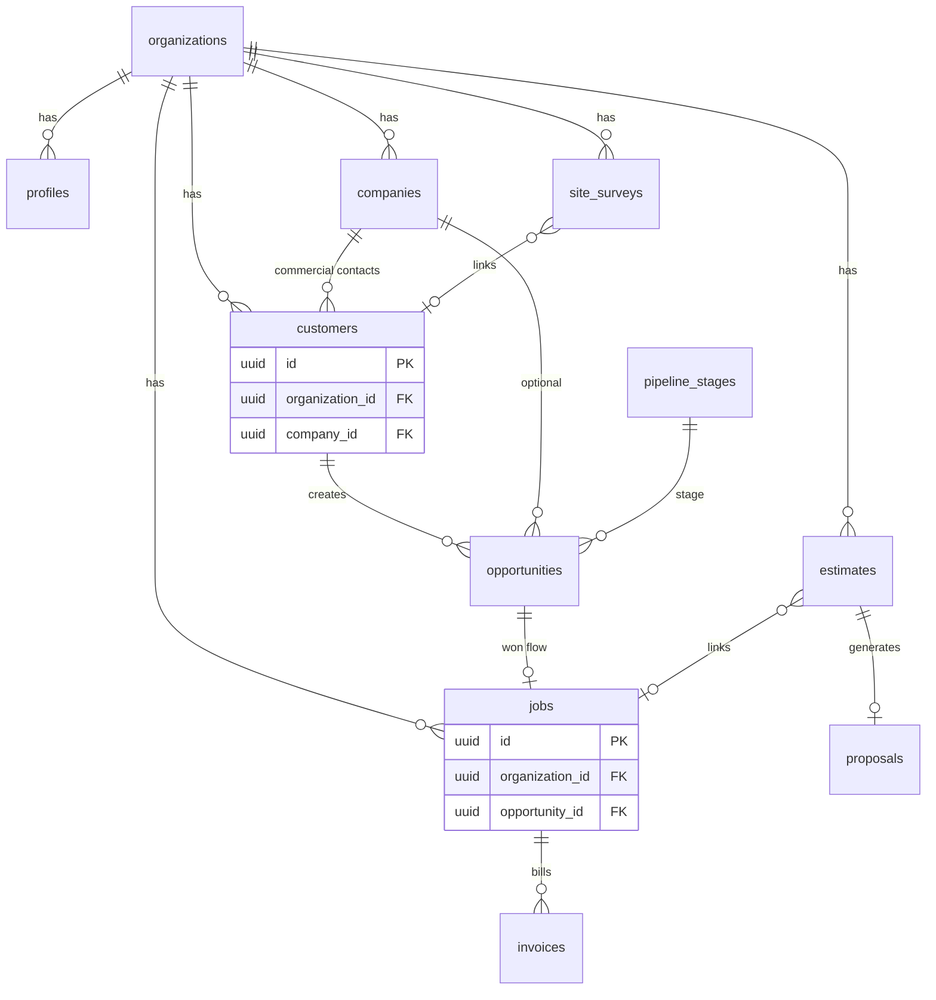

# HazardOS — Database Structure

This document explains how the PostgreSQL schema is organized for the app. The **authoritative definition** of columns, constraints, and policies is the SQL in **`supabase/migrations/`** (apply with the Supabase CLI per [MIGRATION-GUIDE.md](./MIGRATION-GUIDE.md)).

**TypeScript mirror:** [`types/database.ts`](../types/database.ts) reflects many core tables but is **not guaranteed to list every table or column** in the live database. When they disagree, trust migrations.

**Last updated:** April 29, 2026

---

## Design Principles

| Principle | Description |
|-----------|-------------|
| **Multi-tenancy** | Shared schema; almost all business rows include **`organization_id`** referencing `organizations`. |
| **Row-Level Security (RLS)** | Enabled on tenant data; access is scoped with helpers such as **`get_user_organization_id()`** (and role checks where needed). Platform operators may use **`is_platform_user`** / elevated roles where policies allow. |
| **Naming** | Tables and columns use **`snake_case`**. Primary keys are **UUIDs** (`gen_random_uuid()`). |
| **Timestamps** | Common pattern: **`created_at`**, **`updated_at`** with triggers. |
| **PostgREST / Supabase joins** | If a table has multiple FKs to the same target, queries must use **explicit relationship hints** (e.g. `customers!customer_id`) — see [CLAUDE.md](../CLAUDE.md). |

---

## High-Level Entity Map

Conceptual relationships (not every column shown):

- **`customers`** is the **contacts** table in the product UI (historical name).
- **Companies** are created through the commercial contact flow; contacts can reference **`company_id`**.

---

## Tables by Domain

Below, tables are grouped for navigation. Exact columns live in migrations.

### Platform, tenancy, and access

| Table | Role |
|-------|------|
| `organizations` | Tenant: name, address, subscription/billing fields, status. |
| `profiles` | App users; **`organization_id`**, **`role`** (`user_role` enum: platform_owner … viewer), links to `auth.users`. |
| `tenant_invitations` | Pending team invites. |
| `platform_settings` | Global platform configuration. |
| `tenant_usage` | Metering / usage limits per org. |
| `audit_log` | Legacy/audit trail table from early schema (see also activity). |
| `subscription_plans` | SaaS plan definitions. |
| `organization_subscriptions` | Org ↔ plan, Stripe subscription state. |
| `billing_invoices` | Platform billing (SaaS) invoice records. |
| `payment_methods` | Stored payment methods for billing. |
| `stripe_webhook_events` | Idempotency / processing log for Stripe webhooks. |
| `api_keys` | Public API keys (scoped permissions). |
| `api_request_log` | API usage / audit. |
| `custom_domains` | Tenant custom domain configuration. |
| `locations` / `location_users` | Multi-location org structure and user assignment. |
| `cron_runs` | Tracking scheduled job executions. |

### CRM and sales

| Table | Role |
|-------|------|
| `companies` | Business accounts (commercial). |
| `customers` | **Contacts**; residential vs commercial, **`company_id`**, account owner, attribution fields, etc. |
| `customer_contacts` | Additional people tied to a customer record where modeled. |
| `properties` / `property_contacts` | Properties and contact roles (owner, tenant, …). |
| `pipeline_stages` | Org-specific Kanban columns (order, name). |
| `opportunities` | Deals; hazard/property metadata, stage, value, links to **`customer_id`**, **`company_id`**, **`site_survey_id`**, etc. |
| `opportunity_history` | Stage / field change history. |
| `attribution_touchpoints` | Multi-touch marketing attribution events. |
| `follow_ups` | Scheduled follow-ups on entities. |
| `commission_plans` / `commission_earnings` | Sales commissions. |
| `approval_thresholds` / `approval_requests` | Estimate/proposal approval workflow. |

### Site surveys (field assessments)

| Table | Role |
|-------|------|
| `site_surveys` | Main survey row: status, scheduling, **`customer_id`**, mobile JSON sections (access, environment, hazard assessments), metadata. *(Renamed from `assessments`.)* |
| `site_survey_photos` | Photo/video metadata; may reference storage **`path`** in private bucket. *(Renamed from `photos`.)* |

Large structured fields (asbestos/mold/lead JSON) are described in TypeScript in [`types/database.ts`](../types/database.ts) under survey-related interfaces.

### Estimates and proposals

| Table | Role |
|-------|------|
| `estimates` | Header, totals, overrides, approval state, links to customer/job/survey as applicable. |
| `estimate_line_items` | Line-level pricing. |
| `proposals` | Proposal records for PDF / e-sign / portal flows. |
| `estimate_suggestions` | AI-assisted estimate suggestions (if enabled). |

### Jobs and execution

| Table | Role |
|-------|------|
| `jobs` | Scheduled work: dates, containment, permits, revenue/cost fields, **`opportunity_id`**, customer/property links, status. |
| `job_crew` / `job_equipment` / `job_materials` / `job_disposal` | Planning lines for crew, equipment, materials, disposal. |
| `job_change_orders` | Change order records. |
| `job_notes` | Notes. |
| `scheduled_reminders` | Reminders tied to jobs or related entities. |
| `job_time_entries` / `job_material_usage` | Actuals during completion. |
| `job_completion_photos` / `job_completion_checklists` / `job_completions` | Completion workflow. |
| `job_documents` | Uploaded docs (categories: permit, workOrder, clearance, …). |

### Invoicing and payments (customer invoices)

| Table | Role |
|-------|------|
| `invoices` | Customer-facing invoices. |
| `invoice_line_items` | Invoice lines. |
| `payments` | Payment applications. |

### Pricing catalogs (org-level)

| Table | Role |
|-------|------|
| `pricing_settings` | Org pricing configuration root. |
| `labor_rates` / `equipment_rates` / `material_costs` / `disposal_fees` / `travel_rates` | Rate tables. |
| `equipment_catalog` / `materials_catalog` | Optional catalogs for estimates/jobs. |

### Communications and notifications

| Table | Role |
|-------|------|
| `organization_sms_settings` / `sms_messages` / `sms_templates` | Twilio SMS configuration and message history. |
| `email_sends` | Outbound email tracking (multi-tenant). |
| `notifications` / `notification_preferences` / `push_subscriptions` | In-app and push notification plumbing. |

### Integrations and automation

| Table | Role |
|-------|------|
| `organization_integrations` / `integration_sync_log` | QuickBooks and other OAuth/sync integrations. |
| `calendar_sync_events` | External calendar sync rows. |
| `webhooks` / `webhook_deliveries` | Outbound webhooks. |
| `lead_webhook_endpoints` / `lead_webhook_log` | Inbound lead capture endpoints. |

### Marketing and segments

| Table | Role |
|-------|------|
| `customer_segments` / `segment_members` / `marketing_sync_log` | Segmentation and Mailchimp/HubSpot-style sync logging. |

### Feedback and reporting

| Table | Role |
|-------|------|
| `feedback_surveys` / `review_requests` | NPS / testimonials / review requests. |
| `saved_reports` / `report_exports` | Saved report definitions and export jobs. |

### AI (optional features)

| Table | Role |
|-------|------|
| `organization_ai_settings` / `ai_usage_log` | Per-org AI toggles and usage. |
| `photo_analyses` / `voice_transcriptions` | AI feature outputs. |

### Activity and compliance

| Table | Role |
|-------|------|
| `activity_log` | User-visible **activity feed**: who did what on which entity (`entity_type` / `entity_id`), optional JSON diffs. Prefer this for “CRM activity” semantics. |

### Waste workOrders

| Table | Role |
|-------|------|
| `work_orders` / `work_order_vehicles` | Crew-facing dispatch sheet (work order) per job, plus assigned vehicles. Snapshot frozen at issue time. |

---

## Storage (Supabase Storage)

Binary assets (survey photos, videos, job documents) are stored in **Supabase Storage** buckets with policies aligned to **`organization_id`** and auth. Application code often uses **signed URLs** for private buckets; survey media may store **`path`** in `site_survey_photos` (see comments in `types/database.ts`).

---

## Enumerations (PostgreSQL / app)

Commonly used enums (see migrations and [`types/database.ts`](../types/database.ts)) include:

- **`user_role`**: `platform_owner`, `platform_admin`, `tenant_owner`, `admin`, `estimator`, `technician`, `viewer`
- **`organization_status`**, **`subscription_tier`**
- **`hazard_type`**, **`site_survey_status`** (and legacy alias `AssessmentStatus` in TS)
- CRM-related types: **`contact_type`**, **`opportunity_status`**, **`account_status`**, etc.

---

## Related documentation

| Doc | Topic |
|-----|--------|
| [MIGRATION-GUIDE.md](./MIGRATION-GUIDE.md) | How to apply migrations |
| [database/README.md](./database/README.md) | Legacy SQL folder + verification scripts |
| [ARCHITECTURE-OVERVIEW.md](./ARCHITECTURE-OVERVIEW.md) | App architecture and data flow |
| [CLAUDE.md](../CLAUDE.md) | RLS helpers, PostgREST join hints, CRM mental model |

---

*When adding or renaming tables, add a migration under `supabase/migrations/`, then update this doc and `types/database.ts` as needed.*
